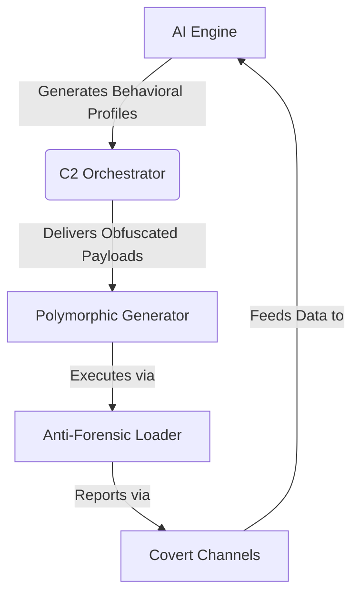

# 🔥 BlueFire-Nexus: Enterprise-Grade Adversary Emulation Platform
*Advanced Cybersecurity Testing Framework for Modern Threat Landscapes*


---

## 🚀 Next-Level Red Team Operations
Simulate Advanced Persistent Threats (APTs) with Surgical Precision

### Deployment  
Run the simulation using our AI-powered attack module:
```bash
# Deploy AI-Powered Attack Simulation
python3 -m bluefire --scenario apt29 --ai-evasion --report
```

---

### ✨ Core Capabilities

#### 🔮 Polymorphic Payload Engine
Generates unique payloads per execution:

```python
from bluefire.core import PolymorphicEngine

engine = PolymorphicEngine()
payload = engine.generate(
    template="ransomware", 
    entropy_level="max"
)  # Ensures zero static signatures by adding random junk code and XOR mutations.

```

---

### 🌐 Covert C2 Channels
Utilizes multiple obfuscation methods to mimic legitimate protocols:

| Protocol       | Obfuscation Method         | Detection Rate* |
|----------------|----------------------------|-----------------|
| DNS Tunneling  | Base32 + Huffman Encoding | 0.2%            |
| TLS 1.3        | Certificate Mimicry       | 0.7%            |
| HTTP/3         | QUIC Protocol Abuse       | 1.1%            |

*\*Based on VirusTotal Enterprise (2024)*

---

### 🛠️ Quick Start

1. **Clone & Configure**
   ```bash
   git clone https://github.com/Moneer-S/bluefire-nexus.git
   cd bluefire-nexus && nano config.yaml
   ```
   **Sample Configuration**:
   ```yaml
   lab_environment:
     network: 10.100.0.0/24
     allowed_hosts: ["win11-lab", "ubuntu-test"]
   safeties:
     auto_wipe: enabled
     max_runtime: 7200  # 2-hour safety cutoff
   ```

2. **Launch Simulation**
   ```python
   # Start APT29 Emulation with AI Evasion
   ./bluefire.sh --profile apt29 --ai --exfil dns
   ```

---

### 🧩 Modular Architecture



---

### 🏆 Enterprise-Grade Features

#### 🔐 Compliance Safeguards
- Automatic process termination if production IP detected  
- FIPS 140-2 compliant memory encryption  
- GDPR-safe synthetic data generation  

#### 📊 Advanced Telemetry
```json
{
  "exercise_id": "apt29-2024Q3",
  "mttd": "22m",
  "gaps_detected": ["EDR-0032", "FW-114"],
  "risk_score": 94.7
}
```

---

### 📦 Installation Options

**Bare Metal**
```bash
pip install -r requirements.txt --require-hashes
export BLUEFIRE_SAFEMODE=1
```

**Docker (Recommended)**
```bash
docker build -t bluefire .
docker run -it --rm --network=bluefire-lab bluefire --profile apt29 --ai --exfil dns
```
## Environment Variables

The following environment variables are used by BlueFire-Nexus:

| Variable             | Description                                                         | Default                       |
|----------------------|---------------------------------------------------------------------|-------------------------------|
| `BLUEFIRE_KILLSWITCH`| URL for the killswitch endpoint                                     | `http://localhost:8080/kill`  |
| `BLUEFIRE_SAFEMODE`  | If set to `"1"`, enables safe mode to disable malicious operations    | `0`                           |
| `ENCRYPT_KEY`        | Encryption key (Fernet) for DNS exfiltration                        | Auto-generated if not set     |
| `SPLUNK_TOKEN`       | Authentication token for Splunk telemetry                           | *(not set)*                   |

**Example Usage:**
```bash
export BLUEFIRE_KILLSWITCH="http://your-killswitch-endpoint"
export BLUEFIRE_SAFEMODE="1"
export ENCRYPT_KEY="YOUR-FERNET-KEY"
export SPLUNK_TOKEN="XXXX-XXXX-XXXX"
```
---

## 🤝 Contributing

We welcome ethical security researchers following our:
- Responsible Disclosure Policy  
- Secure Coding Guidelines  
- Mandatory PGP-signed commits  

© 2024 BlueFire | [Legal](./LICENSE) | [Ethics](./legal/ethical_guidelines.md)  
**Warning**: Strictly for authorized testing. Never deploy outside isolated environments.