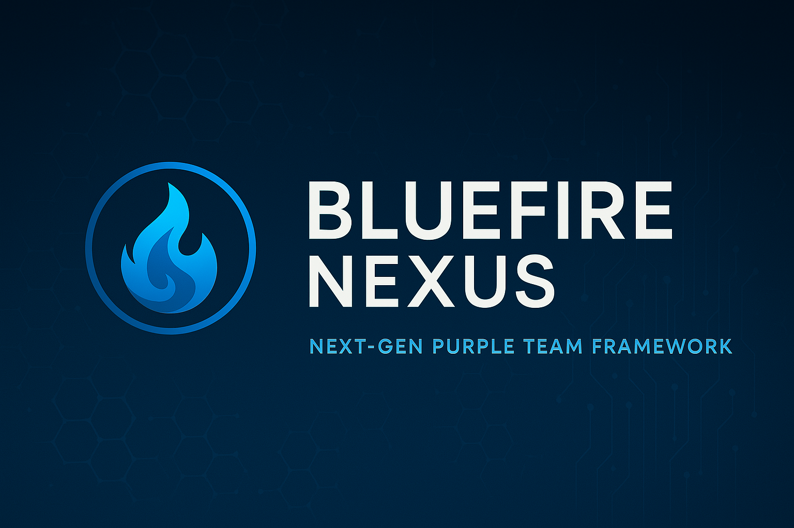
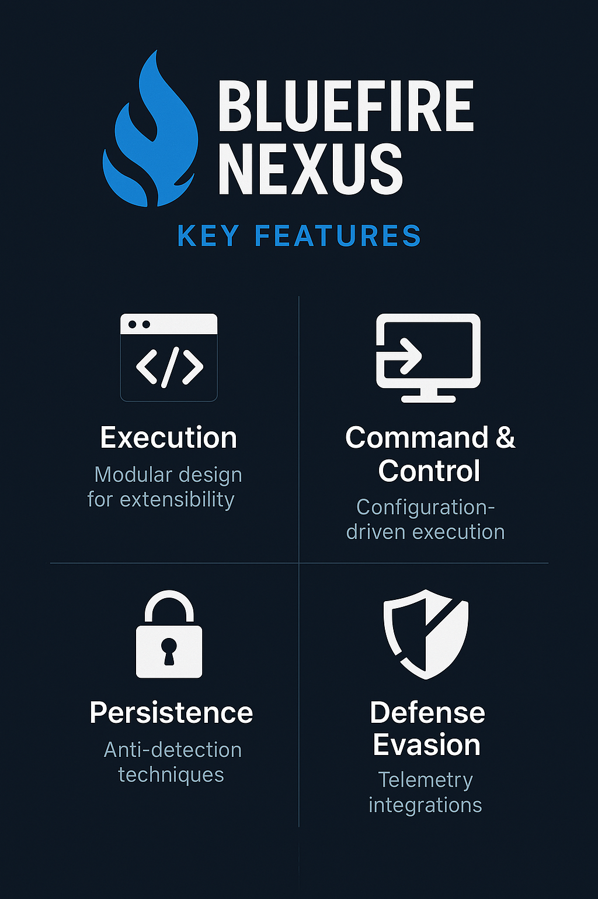

<!-- # BlueFire-Nexus --> <!-- Comment out original title -->

A comprehensive Advanced Persistent Threat (APT) simulation platform designed for security testing, red team operations, and threat hunting within controlled environments.

## Overview

BlueFire-Nexus provides a framework for simulating various APT techniques and tactics, primarily based on the MITRE ATT&CK® framework. It allows security professionals to test detection capabilities, validate security controls, and understand complex attack chains in a safe and isolated lab setting.

**Disclaimer:** This tool is intended for **educational and authorized security testing purposes only** in isolated environments. Unauthorized use or deployment against systems without explicit permission is strictly prohibited. Always adhere to the [Ethical Use Policy](legal/ethical_guidelines.md).

## Features



BlueFire-Nexus is built around a modular architecture, simulating various stages of an APT lifecycle:

*   **Execution:** Manages the execution of commands and payloads.
*   **Command & Control (C2):** Simulates C2 communication channels (e.g., DNS, HTTP) for implant control. (Configuration in `config.yaml` under `modules.command_control.c2_channels`)
*   **Persistence:** Implements techniques to maintain access to compromised systems.
*   **Defense Evasion:** Includes techniques to bypass security controls (e.g., Process Hollowing, Argument Spoofing, Parent PID Spoofing).
*   **Exfiltration:** Simulates methods for extracting data from target environments.
*   **Initial Access:** Models techniques for gaining an initial foothold (e.g., phishing placeholders).
*   **Anti-Detection:** Focuses on techniques to avoid detection by security tools (e.g., Sandbox Evasion, Memory Evasion). (See `src/core/anti_sandbox.py`, `src/core/evasion/anti_detection.py`)
*   **Discovery:** Simulates methods for reconnaissance within a network (e.g., Network/Service Scanning).
*   **Intelligence:** Handles gathering and simulation related to APT group TTPs and threat intelligence.
*   **Network Obfuscator:** Implements techniques for obscuring network traffic patterns.
*   **Resource Development:** Simulates the acquisition and setup of attack infrastructure and capabilities.
*   **Reconnaissance:** Models active and passive information gathering techniques.

*(Note: The implementation depth of each module may vary. Refer to the code in `src/core/` for details.)*

### Security Features

- Modular design based on APT tactics.
- Configuration-driven execution (`config.yaml`).
- Safety mechanisms (configurable in `config.yaml` under `general.safeties`, e.g., `max_runtime`, `allowed_subnets`).
- Placeholder integrations for telemetry (Splunk, Elastic - see `config.yaml` under `telemetry`).

## Installation

```bash
# Clone the repository
git clone <your-repo-url> BlueFire-Nexus
# Example: git clone https://github.com/yourusername/BlueFire-Nexus.git

# Navigate to the project directory
cd BlueFire-Nexus

# Create a Python virtual environment (Recommended)
python -m venv .venv
source .venv/bin/activate  # On Linux/macOS
# .venv\Scripts\activate   # On Windows

# Install dependencies
pip install -r requirements.txt
# Optional: Install dev dependencies
# pip install -r requirements-dev.txt 
```

## Configuration

The main configuration file used by the application is `config.yaml` located in the project root.

1.  **Review/Create `config.yaml`**: If `config.yaml` doesn't exist, a default one might be created on first run (depending on core logic). It's recommended to create it manually based on your needs.
2.  **Use Example as Template**: A detailed template outlining available options and the expected structure (`general`, `modules`, `telemetry`) can be found at `config/config.example.yaml`. You can use this as a reference when creating or modifying your root `config.yaml`.
3.  **Customize `config.yaml`**: Edit the root `config.yaml` file to define your desired simulation parameters, safety settings, module configurations, and telemetry endpoints.

    ```yaml
    # Example structure for ./config.yaml
    general:
      name: "MySimulation"
      mode: "simulation"
      log_level: "INFO" 
      safeties:
        auto_wipe: false # Be careful with auto_wipe!
        max_runtime: 7200 # 2 hours
        allowed_subnets: 
          - "192.168.56.0/24" # Example isolated lab network

    modules:
      # Enable/disable or configure specific modules
      command_control: 
        enabled: true
        c2_channels:
          - protocol: dns
            domain: "apt.internal.lab"
            encryption_key: "{{ env ENCRYPT_KEY }}" # Use env var for secrets

      defense_evasion:
        enabled: true
        # Add specific technique configs if needed

    telemetry: 
      enabled: true
      splunk:
        host: "https://splunk.internal.lab:8088"
        token: "{{ env SPLUNK_TOKEN }}"
      # elastic: ... 
    ```
4.  **Environment Variables**: Note that sensitive values like API keys or encryption keys should be sourced from environment variables (e.g., `{{ env SPLUNK_TOKEN }}`) using a `.env` file or system environment variables. Load dotenv is used (`src/core/config.py`). Create a `.env` file in the root directory:
    ```dotenv
    # .env file
    ENCRYPT_KEY=your_secret_encryption_key_here
    SPLUNK_TOKEN=your_splunk_hec_token_here
    # BLUEFIRE_KILLSWITCH=http://your_killswitch_url (Optional)
    # LOG_LEVEL=DEBUG (Optional, overrides config file)
    ```

## Usage

The primary way to run simulations is via the command-line script:

```bash
# Example: Run the persistence scenario
./scripts/bluefire.sh --profile establish_persistence 

# Example: Run with AI features enabled and DNS exfiltration (if supported)
./scripts/bluefire.sh --profile intel_gathering --ai --exfil dns 
```

This script acts as a wrapper around `src/run_scenario.py`, which likely parses the profile and other arguments to orchestrate the simulation using the `BlueFireNexus` core class.

### Programmatic Usage (Advanced)

It's also possible to import and use the `BlueFireNexus` class directly in Python scripts for more complex integrations or custom scenarios:

```python
from src.core.bluefire_nexus import BlueFireNexus
from src.core.config import config # Access the global config manager

# Ensure config is loaded (BlueFireNexus constructor handles this)
nexus = BlueFireNexus() 

# Access configuration
# c2_config = config.get('modules.command_control', {})

# Execute operations directly (structure depends on module implementation)
# Note: The exact format for 'operation_data' depends on the target module.
try:
    result = nexus.execute_operation("discovery", {
        "scan_type": "network_scan", 
        "targets": ["192.168.56.1/24"]
        # Add other necessary parameters for the discovery module...
    })
    print(f"Discovery Result: {result}")

    result_evasion = nexus.execute_operation("defense_evasion", {
         "technique": "pid_spoofing", 
         "target_command": "powershell.exe -Command ..." 
         # Add other necessary parameters...
    })
    print(f"Evasion Result: {result_evasion}")

except Exception as e:
    print(f"An error occurred: {e}")

```

Refer to the `execute_operation` method in `src/core/bluefire_nexus.py` and the implementations within specific modules (e.g., `src/core/discovery/discovery.py`) for details on required parameters.

## Architecture

The platform is structured as follows:

1.  **Entry Point**: `scripts/bluefire.sh` parses command-line arguments and invokes `src/run_scenario.py`.
2.  **Scenario Runner**: `src/run_scenario.py` likely interprets the profile/arguments and orchestrates the simulation sequence.
3.  **Core Orchestrator**: `src/core/bluefire_nexus.py` contains the `BlueFireNexus` class which initializes and manages all the individual modules. It loads configuration via `ConfigManager` and provides the `execute_operation` method.
4.  **Configuration Manager**: `src/core/config.py` (`ConfigManager` class) handles loading `./config.yaml` and environment variables (`.env`).
5.  **Core Modules**: Located under `src/core/<module_type>/`. Each module (e.g., `CommandControl`, `DefenseEvasion`) encapsulates logic related to a specific APT tactic or function.
6.  **Supporting Code**: Utilities, security functions, loggers potentially reside within `src/core/` or other subdirectories.
7.  **Archived Code**: Unused, experimental, or outdated components are moved to the `archive/` directory for reference.
8.  **Tools**: Separate utilities (like the AI trainer) are in the `tools/` directory.

## Security Considerations

- **Restricted Environment**: **CRITICAL:** Only run BlueFire-Nexus in fully isolated, non-production lab environments where you have explicit authorization.
- **Configuration Safeties**: Carefully configure `general.safeties` in `config.yaml` (e.g., `allowed_subnets`, `max_runtime`) to limit potential impact.
- **Ethical Use**: Strictly adhere to the [Ethical Use Policy](legal/ethical_guidelines.md).
- **Monitoring**: Monitor the simulation environment closely. Utilize the telemetry integrations if configured.
- **Dependencies**: Review dependencies for security vulnerabilities.

## Contributing

Contributions are welcome! Please follow standard GitHub practices:

1.  Fork the repository.
2.  Create a feature branch (`git checkout -b feature/AmazingFeature`).
3.  Commit your changes (`git commit -m 'Add some AmazingFeature'`).
4.  Push to the branch (`git push origin feature/AmazingFeature`).
5.  Open a Pull Request.

Please review `CONTRIBUTING.md` and `DEVELOPER.MD` (if available/updated) for more details.

## License

This project is licensed under the MIT License - see the `LICENSE` file for details.

## Disclaimer

This tool is provided "as is" without warranty of any kind. The authors or contributors are not responsible for any misuse or damage caused by this tool. Use it responsibly and ethically.

## Current Status & Implemented Techniques

This framework is under active development. Key modules and implemented techniques include:

*   **Core:** Basic module loading, configuration handling, logging.
*   **Execution:** Handles direct command execution (`cmd.exe`, `/bin/sh`) and PowerShell execution.
*   **Command & Control (C2):**
    *   HTTP Beaconing (`start_http_beacon`, `stop_http_beacon`): Functional periodic check-ins via GET/POST. Includes basic tasking simulation.
    *   HTTPS Long Polling (`tunnel_c2`/`tunnel`): Functional near-persistent connection via HTTPS POST for tasking.
    *   Proxy Support (`configure_proxy`): Functional support for HTTP/HTTPS proxies for C2 communications.
    *   DNS C2 (`dns_c2`): *Simulation* of sending beacons via DNS A record lookups (requires `dnspython`).
    *   Placeholders: `custom_protocol_c2`, `fallback_channels`, `dynamic_resolution` (mapped to Not Implemented).
*   **Exfiltration:**
    *   Staging (`_stage_and_archive_files`): Functional collection, staging, and optional ZIP archiving.
    *   SFTP (`exfil_sftp`, `alternative_protocol`): Functional exfiltration using `paramiko` (requires host key in `known_hosts`).
    *   FTP (`exfil_ftp`, `protocol_exfiltration`): Functional exfiltration using `ftplib`.
    *   Scheduled Transfer (`scheduled_transfer`): *Simulation* of setting up scheduled exfiltration.
    *   Placeholders: `data_transfer` (mapped to Not Implemented).
*   **Persistence:**
    *   **Windows:**
        *   Scheduled Task (`scheduled_task`): Functional add/remove via `schtasks.exe`. (T1053.005)
        *   Registry Run Keys (`registry_run_key`): Functional add/remove via `win32api`. (T1547.001)
        *   Startup Folder (`startup_folder`): Functional add/remove file via direct write. (T1547.001)
    *   **Linux:**
        *   Cron Job (`cron_job`): Functional add/remove via `crontab` and comment marker. (T1053.003)
        *   Profile Script (`profile_script`): Functional add/remove block to `.bashrc`, `.zshrc` etc. via markers. (T1546.004)
        *   Systemd Unit (`systemd_unit`): *Placeholder exists, implementation failed.* (T1543.002)
    *   **macOS:**
        *   Launch Agent (`launch_agent`): *Handler exists, refinement for add/remove failed.* (T1543.001)
        *   Launch Daemon (`launch_daemon`): *Handler exists, refinement for add/remove failed.* (T1543.004)
    *   **General:**
        *   Boot/Logon Autostart (`boot_logon_autostart_sim`): *Simulation* covering various autostart types. (T1547)
*   **Defense Evasion:**
    *   Timestomp (`timestomp`): Functional file MAC time modification. (T1070.006)
    *   Argument Spoofing (`argument_spoofing`): *Simulation* of launching commands with misleading arguments. (T1564.008)
    *   Process Hollowing (`process_hollowing` - Windows): *Handler exists, complex simulation/implementation.* (T1055.012)
    *   Firewall Manipulation (`firewall_manipulation`): *Placeholder exists, implementation failed.* (T1562.004)
    *   OS-Specific (`hide_file`, etc.): Handlers exist, need review/testing.
*   **Discovery:** Basic handlers for system info, network config, processes etc. exist, need refinement.
*   **Initial Access:** Phishing and Exploitation methods exist as *simulations*, returning placeholder data. (T1566, T1190, etc.)
*   **Lateral Movement:** (Placeholder Module)
*   **Collection:** (Placeholder Module)
*   **Impact:** (Placeholder Module)

**Note:** Functional implementations may require specific libraries (`paramiko`, `dnspython`, `pywin32`) or elevated privileges. Simulations log intended actions without performing them. Recent edit attempts on some handler files encountered tool errors, preventing further functional implementation in those specific areas for now.