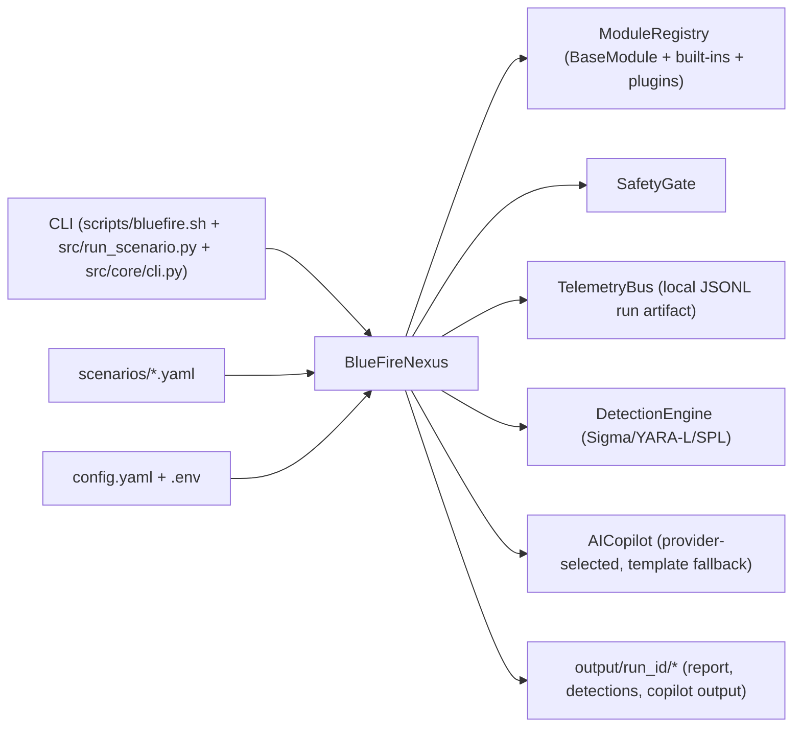

# BlueFire-Nexus

[](#testing)
[](#security-first-defaults)
[](#quickstart)
[](LICENSE)

BlueFire-Nexus is a **high-fidelity adversary emulation and purple-team
research framework**. It models realistic offensive tradecraft (APT actor
packs, credential access, lateral movement, C2 protocol research, evasion,
exfiltration) and pairs it with local defensive outputs (telemetry,
detection drafts, run reports, AI/copilot narratives) in one config-driven
runtime. It is dual-use by nature — intended for authorized lab and
purple-team work, not as a generic BAS/compliance simulator.

Each run can produce:
- ATT&CK-mapped module telemetry as `output/<run_id>/telemetry.jsonl`
- Detection drafts in **Sigma**, **YARA-L**, and **Splunk SPL** — all
  generated locally to `output/<run_id>/detections/`. SPL here is a
  detection-rule output format, not a Splunk exporter or SIEM connector.
- A local run report (Markdown + JSON) and risk summary
- SOC-oriented narrative artifacts via an optional AI copilot (template
  fallback available offline; no API keys required for default operation)

## Security-first defaults

- Dry-run enabled by default (`general.dry_run: true`); a registry-wide
  test asserts no module touches `subprocess`, `socket`, `requests`, or
  `urllib` while dry-run is active.
- No outbound SIEM exporters in the baseline. Telemetry is local-only.
  Legacy `telemetry.sinks` entries naming `splunk`/`opensearch`/
  `elasticsearch`/`ngsiem` are warned-and-ignored at load time.
- AI providers and any future remote integrations are explicit opt-ins.
- Deny-by-default safety gates (`allowed_subnets`, `max_runtime`).
- Advanced offensive research is **gated, not removed**. Legacy capability
  packs (actor / C2 / stealth) ship disabled and require either a master
  lab toggle or per-pack/per-capability enablement in `config.yaml`.
  `simulate` mode is the default; `emulate` requires explicit lab
  confirmation.
- Destructive behavior (e.g. exfiltration with `destructive=true`) requires
  an explicit acknowledgment flag.
- A registry-wide test asserts every module writes its files only under
  `context["output_dir"]` and registers them in `ModuleResult.artifacts`.
- Secret scanning and security checks run in CI (`gitleaks`,
  `detect-secrets`, `bandit`, `pip-audit`); secret scanners run *before*
  Bandit so dual-use findings cannot mask leaked credentials.

Read:
- `SECURITY.md`
- `legal/ethical_guidelines.md`
- `.env.example`

## Quickstart

```bash
python -m venv .venv
source .venv/bin/activate
python -m pip install --upgrade pip
pip install -r requirements-dev.txt
pip install -e .
cp .env.example .env
python -m src.run_scenario --profile apt29_credential_access --output-json
```

Or use the shell wrapper:

```bash
./scripts/bluefire.sh --profile apt29_credential_access --output-json
```

The same install steps are what CI runs (see
`.github/workflows/tests.yml`); a clean clone going through this sequence
should match CI exactly. `netifaces` is an optional `[net]` extra (its sdist
needs a C compiler) — install with `pip install -e .[net]` only if you need
the legacy network discovery helpers that depend on it.

## Core workflows

### Run a scenario file
```bash
python -m src.run_scenario --scenario-file scenarios/healthcare_ransomware.yaml --output-json
```

### Run via Rich/Typer CLI
```bash
python -m src.core.cli run-scenario scenarios/insider_exfil_dns.yaml
python -m src.core.cli plan "Emulate APT29 credential access chain"
python -m src.core.cli suggest-detections run-20260101010101-abcd1234
python -m src.core.cli legacy-presets
python -m src.core.cli legacy-guided-presets
python -m src.core.cli legacy-recommend-preset detection --apply
python -m src.core.cli legacy-scenario-recommendation scenarios/legacy_c2_protocols.yaml --apply
python -m src.core.cli legacy-risk-ladder
python -m src.core.cli legacy-risk-posture --config config.yaml
python -m src.core.cli show-risk-summary output/<run-id>/risk_summary.json --top 10
python -m src.core.cli legacy-operator-guide
python -m src.core.cli legacy-apply-preset c2-sim --config config.yaml
python -m src.core.cli run-scenario scenarios/legacy_flagship_blended.yaml --legacy-preset full-simulate
```

### Enable legacy capability packs quickly or granularly
BlueFire-Nexus now supports advanced legacy research packs for actor emulation,
protocol/C2 experiments, and stealth research. These remain disabled by default
and are communicated up front through config and CLI output.

For a single global lab toggle in `config.yaml`:

```yaml
modules:
  legacy:
    enable_all_lab_capabilities: true
    lab_confirmation: true
    global_mode: simulate
```

For granular per-pack and per-capability control:

```yaml
modules:
  legacy:
    actor_pack:
      enabled: true
      mode: simulate
      capabilities:
        apt29:
          enabled: true
    c2_pack:
      enabled: false
      capabilities:
        dns_tunneling:
          enabled: true
```

The runtime prints a legacy activation summary showing:
- whether the global master toggle is on,
- which packs/capabilities are enabled,
- whether activation came from the master or granular controls,
- whether each capability is in `simulate` or `emulate` mode.

CLI aliases are accepted for convenience and normalized internally:
- C2: `quic_c2`/`quic` -> `websocket_quic`, `network_obfuscator` -> `network_obfuscator_legacy`
- Stealth: `anti_detection` -> `anti_detection_legacy`

Preset profiles are available for quick enablement:
- `safe-baseline`: keep all legacy packs disabled (default-safe posture)
- `full-simulate`: enable all packs in simulate mode
- `full-emulate`: enable all packs in emulate mode with lab confirmation
- `actor-simulate`, `c2-simulate`, `stealth-simulate`: pack-focused simulation presets

You can either:
- apply a preset just for one run (`--legacy-preset` on `run-scenario` / `run-operation`), or
- persist a preset to config via `legacy-apply-preset` (use `--preview-only` for dry preview).
- ask for objective-driven recommendations via `legacy-recommend-preset` and
  inspect all objective mappings with `legacy-guided-presets`.
- derive recommendations directly from a scenario file via
  `legacy-scenario-recommendation`.
- inspect current config risk with `legacy-risk-posture` and run-level risk
  artifacts with `show-risk-summary`.

`python -m src.run_scenario` now also supports:
- `--legacy-guided` to auto-apply the recommended preset from scenario objective,
- `--legacy-pack` and `--legacy-capability` for granular one-by-one overrides.
- It now writes `risk_summary.json` per run and prints its path in the summary.

Legacy config aliases are also supported for backward compatibility:
- `lab_mode` -> `global_mode`
- `lab_acknowledged` -> `global_lab_acknowledged` and `lab_confirmation`
- `emulate_enabled: true` (capability-level) -> emulate mode with lab confirmation

### Programmatic usage
```python
from src.core.bluefire_nexus import BlueFireNexus

nexus = BlueFireNexus("config.yaml")
result = nexus.execute_operation(
    "execution",
    {"command": "echo hello", "network_touch": False},
)
print(result["status"], result["run_id"])
```

## Architecture (current)


```mermaid
flowchart LR
    cliRunner["CLI (scripts/bluefire.sh + src/run_scenario.py + src/core/cli.py)"] --> orchestrator["BlueFireNexus"]
    scenarioFiles["scenarios/*.yaml"] --> orchestrator
    configYaml["config.yaml + .env"] --> orchestrator
    orchestrator --> moduleRegistry["ModuleRegistry (BaseModule + built-ins + plugins)"]
    orchestrator --> safetyGate["SafetyGate"]
    orchestrator --> telemetryBus["TelemetryBus (local JSONL run artifact)"]
    orchestrator --> detectionGen["DetectionEngine (Sigma/YARA-L/SPL)"]
    orchestrator --> aiCopilot["AICopilot (provider-selected, template fallback)"]
    orchestrator --> runArtifacts["output/run_id/* (report, detections, copilot output)"]
```

## Scenario library

- `scenarios/apt29_credential_access.yaml`
- `scenarios/fin7_initial_access_to_c2.yaml`
- `scenarios/healthcare_ransomware.yaml`
- `scenarios/insider_exfil_dns.yaml`
- `scenarios/legacy_actor_apt29.yaml`
- `scenarios/legacy_actor_family_full.yaml`
- `scenarios/legacy_c2_protocols.yaml`
- `scenarios/legacy_stealth_research.yaml`
- `scenarios/legacy_flagship_blended.yaml`

## Legacy capability packs

These packs preserve and surface the most advanced research-oriented parts of
the codebase instead of hiding or deleting them:

- Actor pack: APT29/APT28/APT32/APT38/APT41 research profiles
- C2/protocol pack: DNS tunneling, TLS fast-flux-style beaconing, QUIC, Solana RPC
- Stealth pack: anti-forensic, anti-sandbox, anti-detection, dynamic API research

All of these are normalized into the same runtime model used by standard
modules, so they can produce telemetry, reports, and detection drafts.

## AI provider strategy

User-selected, config-driven provider selection with zero lock-in:
- `template` / `none` (offline deterministic fallback)
- `openai`, `anthropic`, `google`
- `ollama`, `llama.cpp`, `lm-studio`
- `openai_compatible`

By default, provider implementations are safety-preserving and do not force live external calls.

## Telemetry

Telemetry is local-first in the current baseline. Each run writes a JSON
Lines artifact to `output/<run_id>/telemetry.jsonl` alongside the run report
and any detection drafts. There are no outbound SIEM exporters in the
baseline; legacy `telemetry.sinks` config entries naming `splunk`,
`opensearch`, `elasticsearch`, or `ngsiem` are ignored at load time with a
deprecation warning.

## Testing

```bash
pytest -q
python -m compileall -q src tests
```

Three registry-wide enforcement tests run on every module:

- `tests/test_module_contract.py` — every module returns a conformant
  `ModuleResult` (correct fields, types, and a status from
  `success | failure | blocked | skipped | partial_success`).
- `tests/test_module_safety.py` — strict dry-run safety: no module touches
  `subprocess`, `socket`, `requests`, or `urllib` while `dry_run=True`,
  in either lab-off or lab-simulate mode.
- `tests/test_module_artifact_paths.py` — every module writes its files
  only under `context["output_dir"]` and registers them in
  `ModuleResult.artifacts`.

## Development quality gates

- `pyproject.toml`: pytest, black, ruff, mypy, bandit config
- `.pre-commit-config.yaml`: ruff, bandit, detect-secrets, gitleaks
- `.github/workflows/tests.yml`
- `.github/workflows/analysis.yml`

## Case studies

- `docs/case-studies/apt29_credential_access.md`
- `docs/case-studies/legacy_protocol_pack.md`
- `docs/case-studies/legacy_stealth_pack.md`
- `docs/case-studies/healthcare_ransomware.md`

## Optional local lab

`docker-compose.lab.yml` provides a containerised BlueFire profile for running
scenarios in a clean Python environment without installing dependencies on
the host.

## License

MIT. See `LICENSE`.

## Disclaimer

Use only in authorized, isolated environments for defensive testing and research.