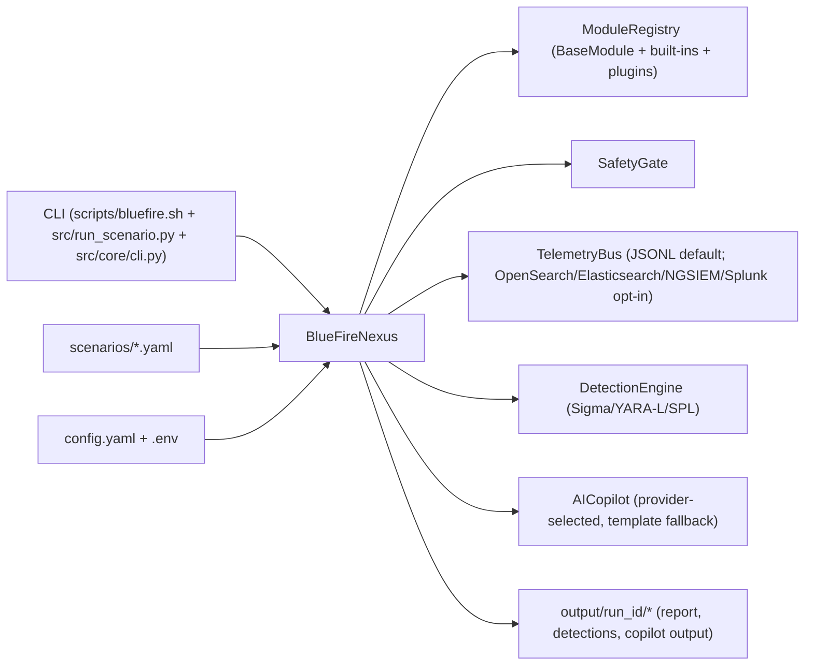

# BlueFire-Nexus

[](#testing)
[](#security-first-defaults)
[](#quickstart)
[](LICENSE)

BlueFire-Nexus is a **config-driven purple-team adversary emulation platform** built to bridge automated detection engineering with human-led investigation.

Each run can produce:
- ATT&CK-mapped module telemetry
- Detection drafts (**Sigma**, **YARA-L**, **Splunk SPL**)
- SOC-oriented narrative artifacts via an optional AI copilot (template fallback available offline)

## Security-first defaults

- Dry-run enabled by default (`general.dry_run: true`)
- No implicit egress to SIEM, AI, or C2 endpoints
- Deny-by-default safety gates (`allowed_subnets`, `max_runtime`)
- Optional destructive behavior requires explicit acknowledgment flag
- Secret scanning and security checks in CI (`gitleaks`, `detect-secrets`, `bandit`, `pip-audit`)

Read:
- `SECURITY.md`
- `legal/ethical_guidelines.md`
- `.env.example`

## Quickstart

```bash
python -m venv .venv
source .venv/bin/activate
pip install -r requirements-dev.txt
cp .env.example .env
python -m src.run_scenario --profile apt29_credential_access --output-json
```

Or use the shell wrapper:

```bash
./scripts/bluefire.sh --profile apt29_credential_access --output-json
```

## Core workflows

### Run a scenario file
```bash
python -m src.run_scenario --scenario-file scenarios/healthcare_ransomware.yaml --output-json
```

### Run via Rich/Typer CLI
```bash
python -m src.core.cli run-scenario scenarios/insider_exfil_dns.yaml
python -m src.core.cli plan "Emulate APT29 credential access chain"
python -m src.core.cli suggest-detections run-20260101010101-abcd1234
```

### Enable legacy capability packs quickly or granularly
BlueFire-Nexus now supports advanced legacy research packs for actor emulation,
protocol/C2 experiments, and stealth research. These remain disabled by default
and are communicated up front through config and CLI output.

For a single global lab toggle in `config.yaml`:

```yaml
modules:
  legacy:
    enable_all_lab_capabilities: true
    lab_confirmation: true
    global_mode: simulate
```

For granular per-pack and per-capability control:

```yaml
modules:
  legacy:
    actor_pack:
      enabled: true
      mode: simulate
      capabilities:
        apt29:
          enabled: true
    c2_pack:
      enabled: false
      capabilities:
        dns_tunneling:
          enabled: true
```

The runtime prints a legacy activation summary showing:
- whether the global master toggle is on,
- which packs/capabilities are enabled,
- whether activation came from the master or granular controls,
- whether each capability is in `simulate` or `emulate` mode.

### Programmatic usage
```python
from src.core.bluefire_nexus import BlueFireNexus

nexus = BlueFireNexus("config.yaml")
result = nexus.execute_operation(
    "execution",
    {"command": "echo hello", "network_touch": False},
)
print(result["status"], result["run_id"])
```

## Architecture (current)


```mermaid
flowchart LR
    cliRunner["CLI (scripts/bluefire.sh + src/run_scenario.py + src/core/cli.py)"] --> orchestrator["BlueFireNexus"]
    scenarioFiles["scenarios/*.yaml"] --> orchestrator
    configYaml["config.yaml + .env"] --> orchestrator
    orchestrator --> moduleRegistry["ModuleRegistry (BaseModule + built-ins + plugins)"]
    orchestrator --> safetyGate["SafetyGate"]
    orchestrator --> telemetryBus["TelemetryBus (JSONL default; OpenSearch/Elasticsearch/NGSIEM/Splunk opt-in)"]
    orchestrator --> detectionGen["DetectionEngine (Sigma/YARA-L/SPL)"]
    orchestrator --> aiCopilot["AICopilot (provider-selected, template fallback)"]
    orchestrator --> runArtifacts["output/run_id/* (report, detections, copilot output)"]
```

## Scenario library

- `scenarios/apt29_credential_access.yaml`
- `scenarios/fin7_initial_access_to_c2.yaml`
- `scenarios/healthcare_ransomware.yaml`
- `scenarios/insider_exfil_dns.yaml`
- `scenarios/legacy_actor_apt29.yaml`
- `scenarios/legacy_actor_family_full.yaml`
- `scenarios/legacy_c2_protocols.yaml`
- `scenarios/legacy_stealth_research.yaml`
- `scenarios/legacy_flagship_blended.yaml`

## Legacy capability packs

These packs preserve and surface the most advanced research-oriented parts of
the codebase instead of hiding or deleting them:

- Actor pack: APT29/APT28/APT32/APT38/APT41 research profiles
- C2/protocol pack: DNS tunneling, TLS fast-flux-style beaconing, QUIC, Solana RPC
- Stealth pack: anti-forensic, anti-sandbox, anti-detection, dynamic API research

All of these are normalized into the same runtime model used by standard
modules, so they can produce telemetry, reports, and detection drafts.

## AI provider strategy

User-selected, config-driven provider selection with zero lock-in:
- `template` / `none` (offline deterministic fallback)
- `openai`, `anthropic`, `google`
- `ollama`, `llama.cpp`, `lm-studio`
- `openai_compatible`

By default, provider implementations are safety-preserving and do not force live external calls.

## SIEM connector priorities

Telemetry sink order and support:
1. OpenSearch
2. Elasticsearch
3. NGSIEM (HEC-style)
4. Splunk HEC
5. JSONL (always available default sink)

## Testing

```bash
pytest -q
python -m compileall -q src
```

## Development quality gates

- `pyproject.toml`: pytest, black, ruff, mypy, bandit config
- `.pre-commit-config.yaml`: ruff, bandit, detect-secrets, gitleaks
- `.github/workflows/tests.yml`
- `.github/workflows/analysis.yml`

## Case studies

- `docs/case-studies/apt29_credential_access.md`
- `docs/case-studies/legacy_protocol_pack.md`
- `docs/case-studies/legacy_stealth_pack.md`
- `docs/case-studies/healthcare_ransomware.md`

## Optional local lab

`docker-compose.lab.yml` provides a simple local stack with OpenSearch + Dashboards + a BlueFire container profile.

## License

MIT. See `LICENSE`.

## Disclaimer

Use only in authorized, isolated environments for defensive testing and research.