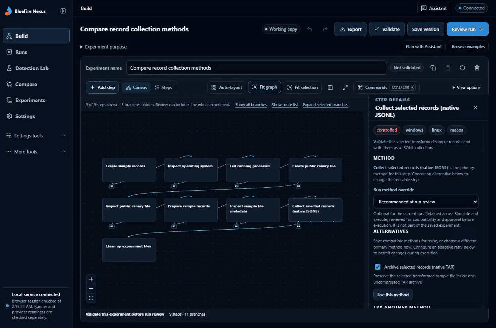

# BlueFire Nexus

BlueFire Nexus runs a security test against a lab you own, collects the evidence separately from
whatever the tool itself claims happened, lets you change a defense, then runs the same test again
and shows you what actually differs.

The workbench runs on your own machine as a local loopback service bound to 127.0.0.1.
Manual and offline AI workflows require no model account. Optional external AI sends the request's
context to the provider you explicitly configure and authorize; that provider may require an account
and charge for usage.

Recorded from the running product in a disposable WSL2 lab: the typed graph for *Compare record
collection methods*, its saved run history, and a completed Execute run's evidence. Captured
September 10, 2026; condensed to 15 seconds with navigation timing edited.

Use it only on systems, accounts, networks, and labs you own or are explicitly authorized to test.
V3 is an unreleased candidate.

## Run it locally

Python 3.10 or newer. [Download the matching PR build and install it](docs/INSTALLATION.md#download-the-candidate) —
that guide links the real Windows, Linux and Intel macOS wheel artifacts and gives exact commands for
a fresh directory. No source checkout or developer dependencies are needed.

    bluefire --runs-dir "<an absolute path you keep>" ui

BlueFire opens your browser once the local listener is ready. If it does not, use the one-use URL
printed in the terminal; `--no-browser` skips the attempt. Keep the terminal running, and reuse the
same absolute `--runs-dir` on every restart so saved experiments, rules, jobs and run bundles stay
with you.

Then, for a first pass that needs no runner, no Docker and no model account: open a packaged
experiment in **Experiments**, review it in **Build**, and in **Runs** choose **Review new run** with
mode **Simulate** and AI **Off**. Run preflight, submit, and open the result. The
[operator guide](docs/OPERATOR_GUIDE.md) walks the visible controls.

A Simulate result records a preview. It is not evidence that a runner action or a defensive control
executed.

## What you do with it

1. **Design** a versioned graph from registered behaviors and typed artifacts, where the success,
   partial, blocked and failed paths are all explicit rather than implied.
2. **Run** it in Simulate, or cross an approval-gated boundary into Execute with an exact profile,
   scope, budgets and a one-time approval.
3. **Observe** through collectors that are attributed separately: what the action reported is
   `executed`, what a collector independently found is `observed`. The two never merge.
4. **Change a defense** by recording the control or detection change, instead of editing the
   baseline result to match the new belief.
5. **Replay** the immutable scenario exactly, or as a declared variant that stays linked to its
   lineage.
6. **Compare** paths, controls, detections, evidence, cleanup and budgets. Compare reports what
   differs; it does not claim the difference proves the defense caused it.

## A measured example

A real staging run in the disposable Linux lab produced five collector observations. Two revisions of
one detection rule, both executed through the Detection Lab with pinned pySigma 1.5.0 and its SQLite
backend, were measured against three separate sample sets.

Revision 1 keys on the staging path prefix. Revision 2 keys on the semantics collector's own
assertion that it parsed a retained-record collection bundle, which does not depend on the directory:

    -- revision 1
    WHERE observation_kind='filesystem' AND path LIKE 'staged/%'

    -- revision 2
    WHERE observation_kind LIKE 'collection\_semantics'
      AND collector_id='collector.collection-semantics.sandbox.v1'
      AND container='jsonl'

| Sample set | Revision 1 | Revision 2 |
|---|---|---|
| The observed run's 5 collected evidence records | 1 match | 1 match, on a different record |
| 4 benign fixtures, one an operator note that happens to sit under `staged/` | 1 match — a false positive | 0 matches |
| 2 attack fixtures staging the identical bundle to another directory | 0 matches — missed | 1 match |

Read those rows precisely. The third row is **two fixtures**, authored to vary the staging path; it is
not a second observed run, and one fixture matching is not a detection rate. The first row is the
only observed-run result here, and both revisions find the same single staging event in it — revision
1 through the filesystem record, revision 2 through the collection-semantics record.

Both rules are narrow by construction. Revision 1 is path-specific and revision 2 is
collector-specific; neither is general attack detection, and neither was evaluated against anything
outside these three sets. What the comparison does show is a false positive removed and a missed
variation caught, with the true positive kept — and `detections compare` reports the rule source
digest actually changed, so this is a different rule rather than a re-labelled copy.

## Modes and authority

Two effect modes. AI autonomy is a separate choice and never widens runner authority.

| | Simulate | Execute |
|---|---|---|
| Lab effects | None | Registered and approved effects only |
| Runner | Not used | Required, and independently enforcing the selected profile |
| Scope | Modeled | Explicit operator scope, bounded by policy and profile |
| Evidence | Synthetic or counterfactual | Executed, blocked, or unknown; `observed` only from a collector |
| Approval and cleanup | Modeled | Reviewed experiment authority and receipt-bound cleanup |

| AI level | What it can do | What it cannot do |
|---|---|---|
| `off` | Use the deterministic planner only | No model call at all |
| `assist` | Draft a typed graph or registered choice for review | Apply a runtime mutation without exact-digest review |
| `auto` | Apply a policy-valid registered choice where mode and policy permit | Invent actions, expand scope, raise a tier, change the runner profile, or bypass Execute approval |

An Execute experiment can include a finite set of alternative methods for a step. Review binds
those methods, their exact inputs and parameters, the objective, scope, limits and cleanup. When
an eligible attempt fails or is prevented, Auto can use the observed result to choose one reviewed
alternative and continue within that authorization. The run retains both attempts and the choice.
Assist retains review; older exact-plan approvals do not gain this authority.

The bundled offline provider makes planner behavior reproducible with no model account, and it is
what release acceptance uses. Connecting an OpenAI-compatible provider changes nothing about
authority: schema validation, allowlists, policy, runner enforcement and approval all still apply.
Live model requests also need a separate review of the exact connection, permitted work and data,
and finite usage limits for the current service session.
Model quality is not something this project measures. See [AI Planner](docs/AI_PLANNER.md).

To plan an experiment, open **Build > Plan with Assistant**, describe an objective, review and edit
the proposed graph in Builder, then save it as its own experiment.
[Graph assistance](docs/contextual-graph-assistance.md) covers saving, recovery and the current
Assist/Auto limits.

## Scope and limits

BlueFire is a local workbench for labs you control. It is not an endpoint-management, cloud
administration, identity, or enterprise-network agent.

- The browser API has same-user loopback session protection, not remote or multi-user
  authentication. Do not expose it through a proxy, tunnel or port forward.
- The managed runner is a per-user process, not an operating-system service. Remote and cross-host
  runner transport and enrollment are not shipped.
- The native action boundary is deliberately narrow: no generic shell, no arbitrary program
  execution.
- Independent observation covers declared sandbox files, one exactly authorized child process on
  Windows and Linux, and authenticated bindings from a managed loopback receiver. Host audit, cloud
  audit, packet capture, EDR and SIEM adapters are declared readiness contracts, not integrations.
- The AWS surface is one reversible disposable-role tagging lab with a deterministic backend.
  Real-account smoke needs an operator-supplied named profile and manual confirmation.
- Detection Lab is a bounded local evaluator, not a SIEM connector. SPL is structural only, and
  public rules are provenance-retaining baselines.
- Bundle and event hashes detect modification. They are not signatures and do not prove who produced
  a bundle.

Anything unavailable or structural stays labeled that way; the
[release capability classification](docs/RELEASE_CAPABILITIES.md) is authoritative.

Integrations retain their source identity and license. The bundled MITRE ATT&CK T1082 record
supplies verified neutral metadata for an independently implemented action. The
[Atomic gzip adaptation](docs/ATOMIC_GZIP.md) uses a fixed system gzip process on Linux; it does
not execute the complete Atomic Red Team framework or bundle GNU gzip. See
[source intake](docs/SOURCE_INTAKE.md) and [third-party notices](THIRD_PARTY_NOTICES.md).

| Surface | Current boundary |
|---|---|
| Python control plane | Python 3.10+ on Windows, Linux and macOS-compatible environments |
| Rust runner | Native Windows x86_64 wheel and a commit-bound Linux x86_64 musl artifact; methods declare their supported platforms |
| Linux proof | Native dynamic execution in a fresh disposable WSL2 environment during release acceptance |
| macOS validation scope | CI includes Intel macOS installed-wheel Execute and cleanup smoke checks; these do not establish full macOS lab acceptance |
| Network actions | Literal loopback addresses in shipped actions and profiles |
| Managed runner | Separate same-user loopback process with local enrollment |
| Cloud identity | One reversible AWS identity lab with deterministic local proof |

## How the product proves itself

Run review exposes the canonical plan, the completed graph path, the event timeline, profile and
scope, evidence provenance, detections, approval state and cleanup result. Every evidence record
carries a producer and one provenance class — `synthetic`, `executed`, `observed`, `control_blocked`,
`counterfactual` or `unknown` — and those classes are never collapsed into each other.

Replay reruns an immutable scenario exactly or as a declared variant, and Compare reports path,
prevention and detection state, telemetry, objective, cleanup and budget deltas.

A locked 12-gate release contract checks all of this on a candidate build, with machine-readable
receipts per gate. See [evidence model](docs/EVIDENCE_MODEL.md),
[replay and compare](docs/REPLAY_COMPARE.md) and [Detection Lab](docs/DETECTION_LAB.md).

## Documentation

- **Start here:** [installation](docs/INSTALLATION.md), [operator guide](docs/OPERATOR_GUIDE.md),
  [configuration](docs/CONFIGURATION.md), [troubleshooting](docs/TROUBLESHOOTING.md)
- **Architecture:** [system architecture](docs/ARCHITECTURE.md),
  [execution model](docs/EXECUTION_MODEL.md)
- **Interfaces:** [local API](docs/API.md), [CLI reference](docs/CLI.md),
  [runner protocol](docs/RUNNER_DEPLOYMENT.md)
- **Security:** [security policy](SECURITY.md), [threat model](docs/THREAT_MODEL.md),
  [responsible use](docs/RESPONSIBLE_USE.md)
- **Reference:** [evidence model](docs/EVIDENCE_MODEL.md),
  [behavior authoring](docs/BEHAVIOR_AUTHORING.md), [source intake](docs/SOURCE_INTAKE.md),
  [AI planner](docs/AI_PLANNER.md), [replay and compare](docs/REPLAY_COMPARE.md),
  [run exports](docs/RUN_EXPORTS.md), [third-party notices](THIRD_PARTY_NOTICES.md)
- **Contributing:** [development and verification](docs/DEVELOPMENT.md),
  [contributing](CONTRIBUTING.md)

## Responsible use and license

Use BlueFire Nexus only on systems, accounts, networks and labs you own or are explicitly authorized
to test. Start in Simulate, use least-privilege runner profiles, prefer disposable targets, review
every Execute plan, and verify cleanup.

Report security issues privately as described in the [security policy](SECURITY.md). BlueFire Nexus
is licensed under the [MIT License](LICENSE).
