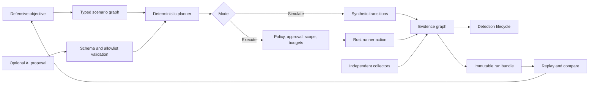
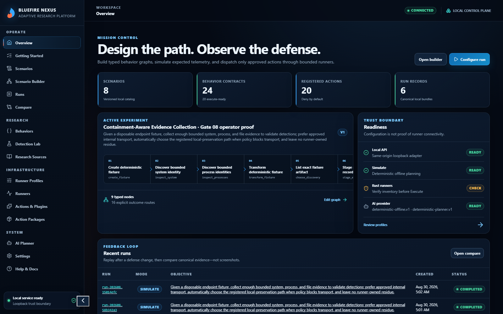
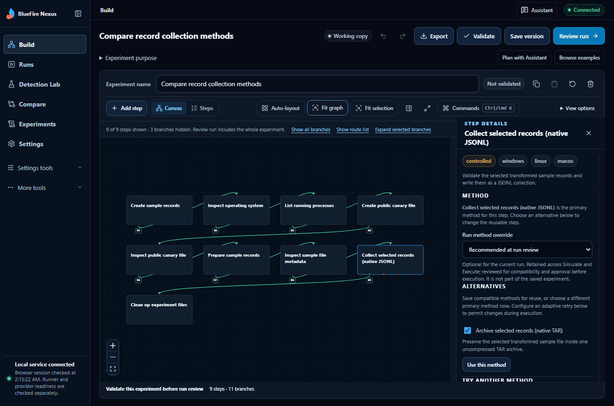
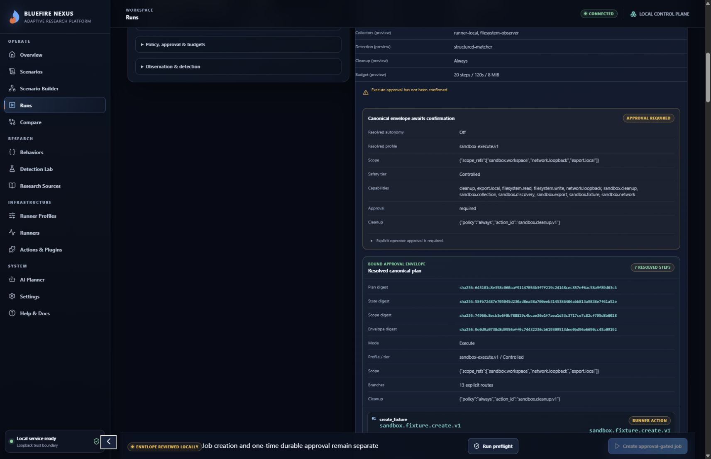
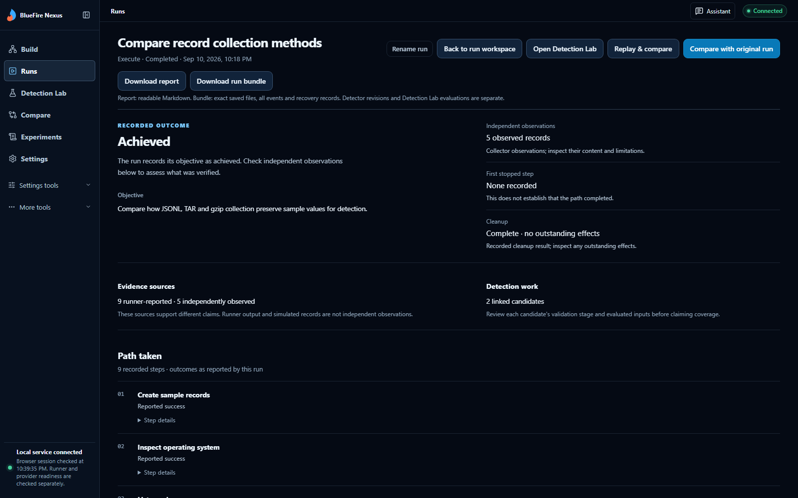
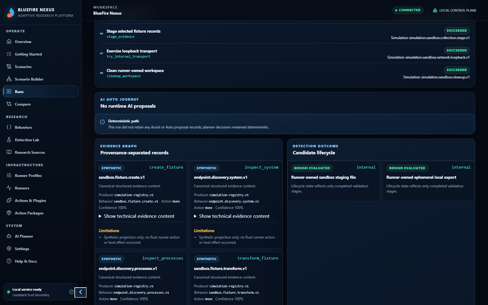
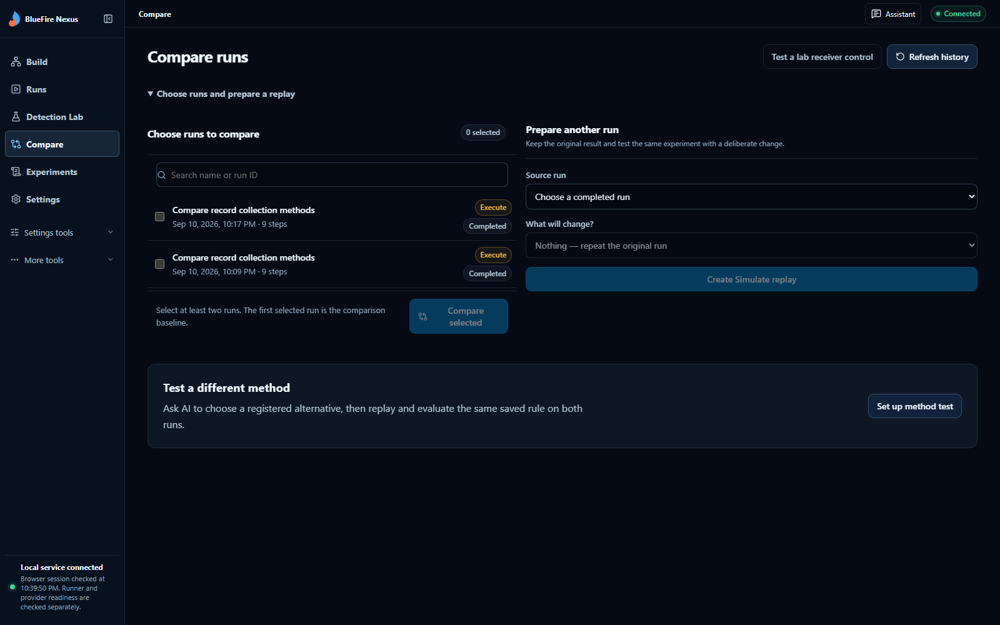
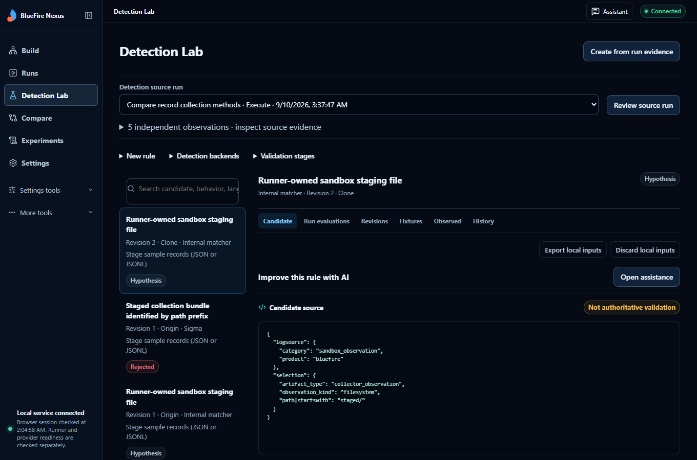
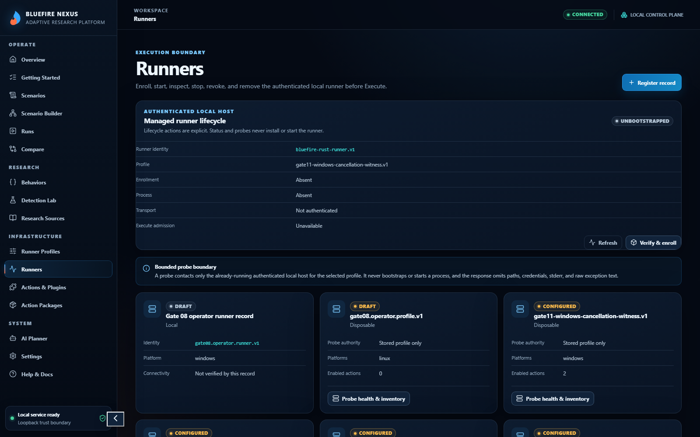
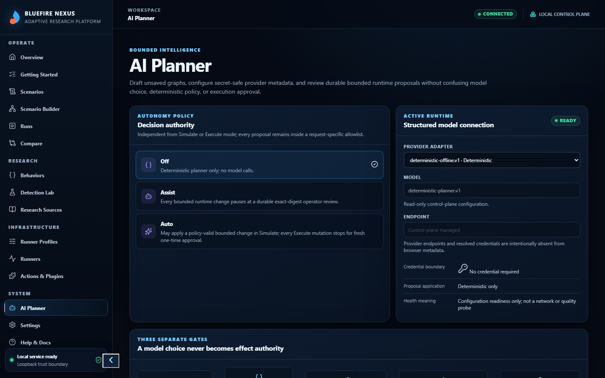

# BlueFire Nexus

**Graph-driven, evidence-aware purple-team experiments with a bounded Rust execution boundary.**

BlueFire Nexus turns a defensive question into a typed behavior graph, runs it in **Simulate** or **Execute**, preserves what was proposed, authorized, dispatched, and observed, then supports replay and side-by-side comparison after a control or detection changes.

It is deliberately not a shell wrapper. The Python control plane can select only registered behaviors and actions. Real effects cross a strict adapter into the separately built Rust runner, where the selected runner profile is enforced again.

> BlueFire Nexus is pre-1.0 software for owned or explicitly authorized labs. Its shipped labs cover bounded endpoint, sandbox, Linux/container, and reversible AWS identity workflows, but it is not a general endpoint-management, cloud-administration, identity, or enterprise-network agent. See [Current limitations](#current-limitations).

## Why BlueFire is different


```mermaid
flowchart LR
    O[Defensive objective] --> G[Typed scenario graph]
    G --> P[Deterministic planner]
    M[Optional AI proposal] --> V[Schema and allowlist validation]
    V --> P
    P --> Y{Mode}
    Y -->|Simulate| S[Synthetic transitions]
    Y -->|Execute| Q[Policy, approval, scope, budgets]
    Q --> R[Rust runner action]
    S --> E[Evidence graph]
    R --> E
    C[Independent collectors] --> E
    E --> D[Detection lifecycle]
    E --> B[Immutable run bundle]
    B --> X[Replay and compare]
    X --> O
```

- Graph edges carry explicit `success`, `partial`, `blocked`, and `failed` outcomes.
- AI autonomy is independent from effect mode: `off`, `assist`, or `auto` never changes the runner's authority.
- A control block is retained as a useful result. It is not normalized into success or hidden as a generic error.
- `synthetic`, `executed`, `observed`, `control_blocked`, `counterfactual`, and `unknown` evidence remain distinct.
- Replay creates a lineage-linked run; comparison reports differences without claiming causality.
- Detection maturity is a lifecycle, not a count of rendered rule files.

## Product loop

1. **Design** a typed behavior graph from reviewed catalog entries.
2. **Simulate** safely or choose approval-gated **Execute** with an exact runner profile and scope.
3. **Observe** through separately attributed collectors without relabeling action output.
4. **Adapt** only through validated graph choices and current policy.
5. **Replay** into a fresh run with immutable lineage.
6. **Compare** evidence, detection, control, cleanup, planner, and implementation dimensions without
   claiming causality.

## Simulate and Execute

BlueFire has exactly two run modes.

| | Simulate | Execute |
|---|---|---|
| Default | Yes | No |
| Runner required | Never | Yes |
| External effects | None | Registered, approved effects only |
| Primary evidence | `synthetic` or `counterfactual` | `executed`, `control_blocked`, or `unknown`; `observed` only from a separate collector |
| Profile | Simulate profile | Explicit Execute profile |
| Scope | Modeled | Explicit operator scope, contained by the profile and runner |
| Approval | Not an execution approval | Required by every shipped Execute profile |
| Cleanup | Modeled | Receipt-bound, revalidated, and independently verified removal |

AI does not create a third mode. Enabling `assist` or `auto` cannot widen target scope, raise the safety tier, change the runner profile, invent an action ID, or bypass approval.

## What ships today

- A strict Python control plane for catalog, scenario, planning, policy, simulation, execution dispatch, evidence, detections, replay, comparison, and local run bundles.
- A React/TypeScript workspace with Overview, Scenarios, Builder, Runs, Compare, Behaviors, Runner Profiles, Runners, Actions, Detection Lab, Research Sources, AI Planner, Settings, and Help areas.
- Twenty compiled Rust actions with versioned inventory descriptors, strict parameter schemas, resource bounds, structured results, and cleanup receipts.
- Eight sanitized scenario graphs, including blocked-path fallback, platform discovery, archive/staging, detection regression, AI-adaptive, restricted-tier canary, representative operator-loop, and deep endpoint-lab examples.
- Official bounded endpoint/identity, disposable Linux/container, and AWS identity lab packs. Automated AWS proof uses a deterministic local backend; the separate real-account smoke path is manual and credential-reference-only.
- A deterministic offline AI provider and an OpenAI-compatible Responses provider using strict structured output, timeouts, retries, token limits, redaction, and deterministic fallback.
- Built-in independent observers for declared sandbox files, one exactly authorized child process through native Windows/Linux interfaces, and authenticated task-bound artifact bindings from a managed loopback receiver, plus a bounded JSONL fixture-log collector. Ordinary Execute defaults to filesystem observation; optional platform-audit, cloud-audit, packet-capture, EDR, and SIEM adapters remain explicit readiness contracts.
- Authoritative pySigma-to-SQLite conversion, bounded in-memory execution for converted Sigma and native SQLite candidates, and YARA compilation/fixture execution when their optional pinned packages are installed; SPL receives structural checks only.
- Content-addressed evidence records, hash-chained run events, finalized bundle manifests, exact/variant replay, and multi-run comparison.
- A migrated local SQLite product store for secret-safe settings, content-addressed scenario versions, typed resources, approval/job state, restart recovery, and indexed run summaries.

### Built-in Rust actions

| Action | Tier | Purpose |
|---|---|---|
| `sandbox.fixture.create.v1` | safe | Create 1..100 exact deterministic JSONL records at `fixtures/input.jsonl` |
| `sandbox.fixture.transform.v1` | safe | Validate and canonicalize the exact fixture schema, optionally replacing every value with the public `synthetic-redacted` placeholder |
| `sandbox.discovery.list.v1` | safe | Return one metadata record for the exact bound fixture without enumerating siblings or reading contents |
| `sandbox.discovery.metadata.v1` | safe | Return one metadata record, including read-only state, for the exact bound fixture without reading contents |
| `endpoint.discovery.system.v1` | safe | Report OS and architecture facts from compiled APIs |
| `endpoint.discovery.windows-version.v1` | safe | Report the Windows major, minor, and build version through the fixed compiled `RtlGetVersion` boundary; it remains latent until a reviewed behavior package binds it |
| `endpoint.discovery.processes.v1` | safe | Return a bounded PID/name inventory through a native or fixed adapter |
| `sandbox.discovery.recursive.v1` | safe | Traverse a runner-owned subtree without following links |
| `sandbox.archive.tar.v1` | controlled | Build a deterministic uncompressed ustar archive from approved files |
| `sandbox.collection.stage.v1` | controlled | Validate exactly one bound fixture and create one deterministic JSON or JSONL bundle, failing before any write on input error |
| `sandbox.network.loopback.v1` | controlled | POST one bounded artifact to a literal allowlisted loopback socket |
| `sandbox.export.local.v1` | controlled | Create a temporary policy-labelled local copy at the runner-fixed `ephemeral` or `review` path; normal cleanup removes either |
| `sandbox.execution.native-canary.v1` | safe | Run 1..4096 rounds of deterministic in-process compiled computation without process, filesystem, or network effects |
| `sandbox.execution.process-tree-cancellation-witness.v1` | safe | Exercise only the runner's fixed Windows child mode and prove nonce-bound cooperative acknowledgement plus complete Job-contained process-tree termination |
| `sandbox.identity-material.seed.v1` | safe | Write one public synthetic canary at the fixed `identity-material/public-canary.json` path for receipt-bound cleanup |
| `sandbox.identity-material.inspect.v1` | safe | Read only the exact public canary and return digest, size, and field-count metadata without values |
| `sandbox.peer.handoff.v1` | controlled | Authenticate one managed one-task capability and move exactly one staged bundle to a distinct one-shot receiver process on literal `127.0.0.1`, retaining opaque handles plus bounded process/lifecycle evidence |
| `sandbox.observability.variant.v1` | safe | Create a fixed-path reversible canonical or `chunked_hex` representation for comparison, with the representation recorded in output metadata |
| `sandbox.restricted.persistence-marker.v1` | restricted | Write one fixed, non-executable persistence-detection canary inside a dedicated runner-owned sandbox |
| `sandbox.cleanup.v1` | safe | Quarantine, revalidate, and remove only receipt-bound objects, then return an authoritative verification report |

The runner does not expose a generic command, shell, script, URL, hostname-resolution, proxy, redirect, dynamic-library, or Python-entry-point action. Process discovery on Linux and macOS uses one platform-selected absolute `ps` path and a fixed argument vector; it is not caller-selectable process execution.

### Included scenarios

| File | What it demonstrates | Validation note |
|---|---|---|
| `scenarios/sandbox_research_chain.yaml` | Seven-step fixture, transform, discovery, staging, loopback/fallback, cleanup chain | Canonical minimal demo |
| `scenarios/linux_container_validation.yaml` | System/process discovery, recursive files, archive, fixture staging, internal transport/fallback, cleanup | Requires an explicitly prepared disposable Linux/container runner for Execute |
| `scenarios/windows_endpoint_validation.yaml` | Harmless Windows-oriented system/process/filesystem discovery, archive/staging, cleanup | Higher-impact Windows persistence/registry/service work is not shipped |
| `scenarios/detection_regression.yaml` | Stable evidence baseline, declared control/detection change, replay, comparison | Does not itself deploy a production detector |
| `scenarios/ai_adaptive_safe_chain.yaml` | Bounded planner choice around an incompatible or blocked internal-transport path | AI proposals remain inside registered graph objects and policy |
| `scenarios/restricted_persistence_canary.yaml` | Restricted-tier canary creation, observation hints, and receipt cleanup | Requires the narrow `sandbox-restricted-owned.v1` profile; it never alters operating-system persistence |
| `scenarios/operator_representative_validation.yaml` | Ten-step native canary, public identity material, fixture pipeline, reversible observability variant, authenticated peer handoff, and cleanup | Uses only fixed runner-owned artifacts; the blocked-network profile refuses peer handoff |
| `scenarios/endpoint_deep_behavior_lab.yaml` | Eleven-step native/discovery, restricted marker, fixture pipeline, transparent telemetry shaping, one-task credential challenge, separate-process peer handoff, and cleanup | Requires `sandbox-endpoint-deep-lab.v1` and a one-shot `--disposable-peer` receiver on literal loopback |

The deep endpoint lab adds narrowly bounded executable proofs for a managed one-task capability, authorized same-host peer movement, and transparent telemetry shaping. Broad credential-access, remote lateral-movement, and defense-evasion `research.*` families remain **metadata-only** contracts. Peer handoff never compromises or authorizes a remote host, the observability variant makes no bypass claim, and the persistence marker never changes host startup state.

An Execute peer handoff requires an active managed enrollment and an independently launched one-shot receiver:

```bash
bluefire receiver --host 127.0.0.1 --port 4317 --max-requests 1 --disposable-peer
```

Disposable-peer mode accepts only one artifact, keeps it memory-only, and exits immediately after
acceptance. Its eight-connection cap leaves a small bounded refusal/probe allowance around the
required challenge and upload. Each connection is capped at five seconds, while both idle and
absolute process lifetime are capped at 240 seconds so the receiver can be started before the
reviewed multi-step endpoint chain without becoming a long-lived service.

## Quickstart: first safe run

Python 3.10 or newer is required. Docker is not required for Simulate.

```bash
python -m venv .venv
# Linux/macOS
source .venv/bin/activate
# Windows PowerShell: .venv\Scripts\Activate.ps1

python -m pip install --upgrade pip
python -m pip install -e ".[dev]"
```

Validate and preview the canonical graph:

```bash
bluefire scenario validate scenarios/sandbox_research_chain.yaml
bluefire scenario preview scenarios/sandbox_research_chain.yaml
```

Installed wheels can resolve packaged scenarios without a checkout path:

```bash
bluefire scenario validate --scenario-id scenario.sandbox.research.chain.v1
```

One-command local demo (defaults to Simulate and writes a local run bundle):

```bash
bluefire --runs-dir .bluefire-runs scenario run --scenario-id scenario.sandbox.research.chain.v1
```

For Execute, pin a registered implementation for a graph step with the repeatable `--action-implementation STEP_ID=ACTION_ID` option. The service validates each choice against the step behavior and exact runner profile, then binds the resolved map into approval.

Inspect the result:

```bash
bluefire --runs-dir .bluefire-runs runs list
bluefire --runs-dir .bluefire-runs runs detail RUN_ID
bluefire --runs-dir .bluefire-runs bundle validate RUN_ID
```

`RUN_ID` is printed by the run command. A successful Simulate run proves that graph validation and simulation completed; it does not prove a runner action or defensive control executed.

## Launch the product UI

The packaged UI uses the same loopback service as the CLI:

```bash
bluefire --runs-dir .bluefire-runs ui --host 127.0.0.1 --port 8765
```

Open the exact one-use URL printed only after the listener is ready. Its 384-bit capability stays in the URL fragment, is removed before the first request, and is exchanged once for a strict eight-hour HttpOnly API cookie. A bare URL works only in a browser that already holds that session; otherwise relaunch with `bluefire ui`. The service rejects non-loopback binds. This is same-user local protection, not remote or multi-user authentication; do not publish it through a proxy, tunnel, or port forward, and do not copy the launch URL into logs or issue trackers.

### Product tour

These screenshots come from the Python-backed local service with sanitized fixture data. They demonstrate the interface and control boundaries; synthetic records are labeled and are not presented as proof of host execution or defensive control coverage.

| Mission control | Typed graph builder | Execute review |
| --- | --- | --- |
|  |  |  |
| Counts, readiness, active experiment, and canonical run history. | Registered behaviors, typed artifacts, explicit routes, and node parameters. | Profile-owned scope, tier, cleanup, and budgets are visible; approval remains disabled until canonical preflight. |

| Production live run | Provenance-separated evidence | Replay comparison |
| --- | --- | --- |
|  |  |  |
| A real local job exposes its canonical plan, completed graph path, timeline, and review handoff without claiming external effects. | Structured content, producer, behavior, action, confidence, and limitations remain visible. | Baseline and lineage-linked variant lanes compare path, objective, cleanup, evidence, telemetry, and controls. |

| Detection Lab | Runner inventory | AI Planner |
| --- | --- | --- |
|  |  |  |
| Hypothesis, parser/fixture/observed/benign stages, and non-authoritative structural status remain explicit. | Unbootstrapped lifecycle state and unverified drafts expose no browser-visible paths or credentials. | Provider metadata, authority boundaries, and an explicitly unsaved, unauthorized graph draft stay separate. |

For frontend development:

```bash
cd frontend
pnpm install --frozen-lockfile
pnpm dev
```

`pnpm dev` is the sanitized demo-only hot-reload surface and refuses Execute. It deliberately has no live API proxy because the production browser-session exchange is bound to the Python listener's exact origin. For live control-plane testing, run `pnpm build`, launch `bluefire ui`, and open the exact capability-bearing URL printed by the CLI. The build writes production assets to `bluefire/ui` for packaging.

## First scenario walkthrough

1. Open **Scenarios** and select **Neutral sandbox research chain**.
2. Open **Builder**. Inspect typed input bindings and the compatible metadata-discovery alternate.
3. Open **Runs**, keep **Simulate** and AI **Off**, then run preflight.
4. Review the graph path, expected telemetry, profile, scope, budgets, and cleanup plan.
5. Start the run. The loopback step may follow its declared fallback route; this is part of the scenario contract.
6. In run review, keep synthetic expected evidence separate from independent observations.
7. Copy the run ID, replay it exactly or with a declared defense note, then compare the two bundles.

The browser demo mode is explicitly synthetic and refuses Execute dispatch. For canonical results, use the Python-backed UI rather than treating seeded browser data as a run.

## Execute with the Rust runner

Execute is opt-in and requires an explicit managed-runner bootstrap and start. A compatible platform-native wheel supplies the verified artifact. For source development, build the runner and use the environment override shown below:

```bash
python tools/build_native_runner.py
./runner/target/release/bluefire-runner inventory --json
```

On Windows, read the same inventory with the `.exe` artifact:

```powershell
.\runner\target\release\bluefire-runner.exe inventory --json
```

Set environment variables to the built binary and a disposable sandbox you own. Do not put their resolved values in tracked YAML.

```bash
# Linux/macOS example
export BLUEFIRE_RUNNER_BINARY="$(pwd)/runner/target/release/bluefire-runner"
export BLUEFIRE_SANDBOX_ROOT="$(pwd)/.bluefire-sandbox"
mkdir -p "$BLUEFIRE_SANDBOX_ROOT"
```

```powershell
# Windows PowerShell example
$env:BLUEFIRE_RUNNER_BINARY = (Resolve-Path .\runner\target\release\bluefire-runner.exe)
$env:BLUEFIRE_SANDBOX_ROOT = (New-Item -ItemType Directory -Force .\.bluefire-sandbox).FullName
```

Install or verify the exact artifact, establish local enrollment, and start the separately hosted authenticated runner before starting the receiver or requesting Execute:

```bash
bluefire --config config/bluefire.example.yaml runner bootstrap --profile sandbox-execute.v1
bluefire --config config/bluefire.example.yaml runner start --profile sandbox-execute.v1
bluefire --config config/bluefire.example.yaml runner status --profile sandbox-execute.v1
```

These are explicit lifecycle actions. `runner status` alone is inert and never bootstraps or starts a process.

Provision the reviewed loopback receiver in a separate terminal before an Execute run that uses
`sandbox.network.loopback.v1`:

```bash
bluefire receiver --host 127.0.0.1 --port 4317 \
  --max-requests 1 --max-connections 16 \
  --max-body-bytes 5242880 --idle-timeout 300
```

The receiver requires the active managed runner enrollment and binds a literal loopback address
only. The runner first obtains an authenticated, one-time
`GET /bluefire/v1/challenge`, then sends exactly `POST /bluefire/v1/artifact`. The challenge,
request, and acknowledgement bind the exact task, ephemeral receiver session, nonce, listener,
declared length, and `X-BlueFire-SHA256`. The receiver treats the body as opaque bytes and does not
execute, forward, or redirect content. By default it transiently
buffers at most `--max-body-bytes` for digest verification and does not persist the body. To preserve
the artifact, explicitly add `--storage-dir /tmp/bluefire-receiver-artifacts-SESSION`; the dedicated
directory must be empty on first use and is then marked and used only for content-addressed receiver
files. Never choose a repository, personal, shared, or production directory. The readiness record
reports the bound
host and port without reporting a filesystem path. `--max-requests` counts accepted artifacts, so a
malformed request does not consume the intended Execute slot; `--max-connections` separately caps
all accepted TCP connections, including refusals, and must be at least twice `--max-requests` so
each possible success has a challenge and upload connection. The runner treats a 2xx response as success only
when its bounded canonical JSON acknowledgement has the expected schema, accepted flag, exact task
and session, byte count, echoed artifact digest, boolean storage result, and valid HMAC.

This authenticates the same-user managed receiver session; it remains a loopback lab protocol, not
remote transport or authorization for another host, port, task, or session. The bounded idle default
is 300 seconds and can be reduced explicitly for automation.

Check inventory and preflight before approval:

```bash
bluefire --config config/bluefire.example.yaml runner status --profile sandbox-execute.v1
bluefire --config config/bluefire.example.yaml scenario preview \
  scenarios/sandbox_research_chain.yaml \
  --mode execute \
  --profile sandbox-execute.v1 \
  --scope-ref network.loopback \
  --scope-ref export.local
```

After reviewing the exact plan and target scope:

```bash
bluefire --config config/bluefire.example.yaml --runs-dir .bluefire-runs scenario run \
  scenarios/sandbox_research_chain.yaml \
  --mode execute \
  --profile sandbox-execute.v1 \
  --scope-ref network.loopback \
  --scope-ref export.local \
  --approve \
  --approved-by local-operator
```

The CLI adds `sandbox.workspace` to scenario-run scope by default. The other references above authorize only the scenario's reviewed fallback choices. The Rust runner independently checks the action inventory, profile digest, request hash, platform, capabilities, tier, filesystem/network scope, limits, approval lifetime, and cleanup binding.

See [Runner deployment](docs/RUNNER_DEPLOYMENT.md), [Runner profiles](docs/RUNNER_PROFILES.md), and [the execution model](docs/EXECUTION_MODEL.md) before Execute.

## AI Planner

Autonomy is independent of Simulate/Execute:

| Level | Model behavior | Application rule |
|---|---|---|
| `off` | No model call | Deterministic planner only |
| `assist` | Draft typed graphs and propose bounded registered choices | Persist every actionable runtime proposal for exact-digest operator review before mutation |
| `auto` | Draft typed graphs and propose the exact observed edge, compatible behavior, bounded primitive parameters, exact-profile action, or one retry | May apply a policy-valid choice in Simulate; every Execute mutation pauses for review, fresh-workspace replay, and fresh exact approval |

The base configuration uses `deterministic-offline.v1`. To use the included OpenAI-compatible Responses provider, set the referenced environment variable locally and select the provider:

```bash
export OPENAI_API_KEY="..."          # Linux/macOS
# Windows PowerShell: $env:OPENAI_API_KEY = "..."

bluefire --runs-dir .bluefire-runs scenario run scenarios/ai_adaptive_safe_chain.yaml \
  --autonomy assist \
  --ai-provider openai-responses.v1
```

Unlike `scenario preview`, this Simulate run can construct the selected provider and request a
bounded runtime proposal after an observed step outcome. Preview validates configuration only and
does not contact a model endpoint. A real provider call still depends on operator credentials and
network access; offline tests use a fake transport and do not certify endpoint connectivity or model
quality.

Provider configuration lives under `ai.providers` in `config/bluefire.example.yaml`. The YAML stores the environment-variable name, endpoint, model, timeout, retry count, output-token limit, and redaction policy—not the secret value. If credentials are missing, the provider times out, or structured output is invalid, BlueFire uses the deterministic fallback and records that fact.

The Builder and AI Planner can send a natural-language objective to `POST /api/v1/ai/drafts`. The response is an unsaved typed graph containing only allowlisted registered behaviors and primitive registered parameters. Scenario identity, artifact bindings, provenance, and validation are derived deterministically; mode, profile, scope, policy, approvals, actions, commands, and paths are excluded from the model contract.

The provider is a proposal boundary, not an execution authority. It cannot emit free-form execution, install an action, change the selected runner/profile, expand scope, raise a tier, approve itself, or declare its own detection validated. See [AI Planner](docs/AI_PLANNER.md).

## Replay and compare

Exact replay retains the source scenario snapshot and autonomy/provider selection:

```bash
bluefire --runs-dir .bluefire-runs replay RUN_ID --exact
```

Declared variants can restart from a node using a trusted materialized checkpoint, swap to a contract-compatible behavior, change typed parameters, select another registered per-step action implementation, change autonomy/provider/profile, or attach a defense-change note. Parameter overrides are currently exposed through the UI/API; the CLI covers the other variants:

```bash
bluefire --runs-dir .bluefire-runs replay RUN_ID \
  --from-step-id discover_records \
  --autonomy off \
  --defense-change "Enabled the reviewed staging correlation"
```

Compare two or more runs; the first is the baseline:

```bash
bluefire --runs-dir .bluefire-runs compare BASELINE_RUN_ID CANDIDATE_RUN_ID
```

Comparison reports path and first-block divergence, outcome counts, objective state, sanitized planner-decision and implementation-identity deltas, evidence provenance, independent observed-artifact and evidence-gap deltas, detection lifecycle/matches, telemetry, policy/control states, cleanup, target-scope digest/count, replay variant lineage, autonomy/provider, AI proposal application, budgets, duration, and coarse improvement/regression signals. It does not expose raw planner rationale or infer arbitrary predicted-versus-observed field causality. A reported delta is not proof that the declared change caused it. See [Replay and compare](docs/REPLAY_COMPARE.md).

## Evidence and Detection Lab

Every evidence record is attributable to a producer and one provenance class:

- `synthetic`: modeled or fixture-generated;
- `executed`: reported by a runner after an action started;
- `observed`: independently collected by a declared collector;
- `control_blocked`: a policy or defensive control prevented the action;
- `counterfactual`: modeled continuation after a real path stopped;
- `unknown`: the system cannot establish the requested observation.

Detection candidates move through `hypothesis` → `parsed` → `fixture_exercised` → `observed_exercised` → `benign_evaluated`, or `rejected`. Stages are evidence-driven and cannot be skipped.

For authoritative parser/compiler adapters:

```bash
python -m pip install "pysigma==1.5.0" "pysigma-backend-sqlite==1.2.2" "yara-python==4.5.4"
python -m pytest tests_platform/test_detections.py
```

The installable YARA adapter and its reviewed upstream research record are both pinned to 4.5.4. YARA-L is a different language and is not represented as executable through YARA-Python.

The optional SQLite conversion backend is pinned to package version 1.2.2 and reviewed upstream tag `v1.2.2` at commit `cfc0a2dd75470f73e2e375c3e58aecc21a33fbc6`. It is LGPL-3.0-only and the official plugin directory labels it `testing`. Installing the package or recording its provenance is not evidence that BlueFire converted or executed a Sigma rule; trust only persisted lifecycle results containing the exact source/query digests, backend versions, field assessment, and bounded execution outcome.

- Sigma uses pySigma to parse exactly one rule, converts it through the pinned SQLite backend, and freshly reconverts before every bounded execution.
- Native `target_language="sqlite"` candidates use the same fixed-schema, query-only, authorizer-guarded in-memory executor. Conversion/parse leaves `source_rule_executed: false`; real fixture or observed-record evaluation changes it to `true`.
- YARA uses YARA-Python compilation with includes disabled and warnings as errors, then bounded malicious and benign fixture execution with evaluated/matched IDs.
- SPL has a bounded structural checker but remains a hypothesis without a real backend parser.
- Public rules are provenance-retaining baselines, not automatic evasion targets.

See [Evidence model](docs/EVIDENCE_MODEL.md) and [Detection Lab](docs/DETECTION_LAB.md).

## Research provenance

The built-in registry records project, authority, pin-bearing HTTPS reference, version/pin/exact ref, retrieval and verification dates, license, file-level review, trademark considerations, relationship, use classification (`reference_only`, `metadata_import`, `clean_reimplementation`, `external_adapter`, `compatible_code_adaptation`, or `incompatible_or_restricted`), intended use, imported/adapted paths, attribution, security review, transformation history, update status, and cache policy. The registry validates that the URL contains the declared non-moving pin, but it does not fetch remote bytes or prove that a remote tag or URL target cannot move.

One reviewed declarative source is vendored: the exact MITRE ATT&CK® Enterprise v19.2 T1082
STIX record at `bluefire/data/mitre_attack_t1082_v19_2.json`, pinned to commit
`8543c5b05bd9bbcace9fc37f30bba96b675b6f33`, together with its
complete pinned `LicenseRef-MITRE-ATTACK-2026` license. The required notice is “© 2026 The
MITRE Corporation. This work is reproduced and distributed with the permission of The MITRE
Corporation.” Deterministic intake validates the source digest, discards descriptions,
citations, procedures, command examples, and unrelated references, and projects only neutral
metadata. Generated envelopes and signed packages remain content-addressed acceptance/runtime
state rather than checked-in artifacts. No upstream code or payload is executed, and the mapped
`endpoint.discovery.windows-version.v1` action is an independently implemented, Windows-only
compiled BlueFire operation that returns exact major, minor, and build fields through the fixed
`RtlGetVersion` API. It has no built-in behavior and becomes operator-usable only through the
reviewed intake package; no MITRE endorsement is implied.

Other registry entries reference Sigma specification 2.1.0, pySigma 1.5.0, the pySigma SQLite
backend 1.2.2 at commit `cfc0a2dd75470f73e2e375c3e58aecc21a33fbc6`,
yara-python 4.5.4, and an Atomic Red Team comparative snapshot at commit
`6132b92779873cb0d05bef07ba0a480d47eb1cc8`. Those external datasets, scripts, and corpora
are not vendored or executed during source intake. See [Source intake](docs/SOURCE_INTAKE.md)
and [Third-party notices](THIRD_PARTY_NOTICES.md).

## Supported platforms

| Surface | Current support |
|---|---|
| Python control plane | Python 3.10+ on Windows, Linux, and macOS-compatible environments |
| Rust runner | The Windows x86_64 wheel carries a verified native runner; a separate commit-bound Linux x86_64 musl artifact supports the disposable Gate 11 journey; source builds remain available for development, while macOS proof is structural when no host is available |
| System discovery | Compiled standard-library/platform APIs |
| Process discovery | Windows Toolhelp API; fixed absolute `ps` adapter on Linux/macOS |
| Network | Literal loopback IP only in the shipped action/profile |
| Managed runner | Separate same-user loopback host with TLS 1.3 mutual authentication and local enrollment; cross-host runners are not shipped |
| Sysmon/Event Log, auditd, PCAP, cloud audit, EDR, SIEM | Descriptor/readiness contracts only; no configured production adapter ships |
| Cloud and identity execution | A bounded AWS identity lab ships with deterministic local Simulate/Execute, opaque credential handles, reversible role tagging, cleanup, and audit expectations; real AWS validation is a separately confirmed manual smoke using a named credential profile, not a general cloud runner |

The opt-in scenario E2E harness can use `BLUEFIRE_E2E_RUNNER` to exercise safe adapters on the current host. Release GATE-11 separately requires dynamic packaged Windows Execute and a fresh disposable WSL2 Linux journey using the commit-bound x86_64 musl runner. A missing or incompatible WSL boundary is reported as unavailable and does not count as Linux proof; macOS remains structural when no macOS host is available.

## Development and verification

```bash
python -m compileall -q bluefire tests_platform
python -m pytest
python -m ruff check bluefire tests_platform
python -m black --check bluefire tests_platform
python -m mypy bluefire
python -m bandit -r bluefire -ll
python -m pip_audit --ignore-vuln PYSEC-2026-2447  # reviewed optional pySigma/DiskCache exception; see SECURITY.md
python -m build

cargo fmt --manifest-path runner/Cargo.toml -- --check
cargo clippy --manifest-path runner/Cargo.toml --all-targets --all-features -- -D warnings
cargo test --manifest-path runner/Cargo.toml --all

cd frontend
pnpm typecheck
pnpm lint
pnpm test
pnpm build
pnpm test:e2e
```

Security and release checks should also include detect-secrets/Gitleaks, staged-diff checks, built-wheel inspection, installed-wheel CLI/API smoke, and the opt-in real-runner E2E test in a disposable environment. See [Development](docs/DEVELOPMENT.md) and [Contributing](CONTRIBUTING.md).

The canonical release authority is `bluefire acceptance run --release`. It refuses an uncommitted worktree, executes the exact ordered GATE-01 through GATE-12 contract, and writes a hashed result directory under the ignored `build/product-acceptance/` tree. GATE-01 keeps only durable evidence there: its committed-source archive, wheel build, fresh virtual environment, isolated helper, and managed runtime use owner-private, short-lived storage outside the checkout and are removed before the gate can pass. Independently re-check a persisted result, its locked contract snapshot, canonical run bundles, and every evidence byte with `bluefire acceptance verify --result <acceptance-result.json>`. A failed or incomplete receipt remains a failed gate; documentation is never accepted as gate proof.

For the historical pre-1.0 product boundary and explicit non-claims, see the [pre-release baseline](docs/PRE_RELEASE_BASELINE.md). It is context only and does not satisfy a release gate.

## Documentation

- [User guide](docs/USER_GUIDE.md) and [command-line reference](docs/CLI.md)
- [Installation](docs/INSTALLATION.md), [configuration](docs/CONFIGURATION.md), [operator guide](docs/OPERATOR_GUIDE.md), and [troubleshooting](docs/TROUBLESHOOTING.md)
- [Architecture](docs/ARCHITECTURE.md) and [execution model](docs/EXECUTION_MODEL.md)
- [Threat model](docs/THREAT_MODEL.md) and [responsible use](docs/RESPONSIBLE_USE.md)
- [Runner deployment](docs/RUNNER_DEPLOYMENT.md) and [runner profiles](docs/RUNNER_PROFILES.md)
- [Action SDK](docs/ACTION_SDK.md), [plugin manifest SDK](docs/PLUGIN_SDK.md), and [behavior authoring](docs/BEHAVIOR_AUTHORING.md)
- [Extension boundary](docs/EXTENSIONS.md), [release capability classification](docs/RELEASE_CAPABILITIES.md), and [GitHub metadata recommendations](docs/GITHUB_METADATA.md)
- [AI Planner](docs/AI_PLANNER.md)
- [Detection Lab](docs/DETECTION_LAB.md) and [evidence model](docs/EVIDENCE_MODEL.md)
- [Replay and compare](docs/REPLAY_COMPARE.md)
- [Local API](docs/API.md)
- [Development](docs/DEVELOPMENT.md), [migration](docs/MIGRATION.md), and [contributing](CONTRIBUTING.md)

## Current limitations

- BlueFire is local-first and pre-1.0. The API requires a same-user browser session on loopback but has no remote or multi-user authentication layer.
- The current Windows x86_64 wheel includes a manifest-bound Rust runner. Explicit `bluefire runner bootstrap` verifies and installs that host-compatible resource in the private per-user product root and creates local enrollment; `runner start`/`stop` manage a separately hosted per-user process, not an operating-system service or daemon installer. The Linux x86_64 musl artifact is retained separately for commit-bound disposable validation and is not evidence of a general Linux installer.
- Local runner transport uses TLS 1.3 mutual authentication plus enrollment-bound message authentication, and the managed lifecycle implements local revocation and confirmed removal. Remote or cross-host transport/enrollment and asymmetric signed task/profile/result artifacts are not shipped.
- The loopback artifact receiver authenticates an ephemeral same-user session with per-task managed-enrollment HMAC; it is not remote transport or cross-user authorization.
- Runner readiness binds the probed binary digest and inventory, but BlueFire does not provide OS code signing or eliminate the local binary time-of-check/time-of-use interval before launch.
- The native action inventory is intentionally bounded to runner-owned fixtures, discovery, staging/archive, local export, authenticated loopback transport, public fixed-path canaries, reversible observability comparison, bounded in-process computation, and cleanup. It has no general shell or arbitrary program execution.
- Plugin activation inventories reviewed metadata only; it does not download/load a package or add dynamic behaviors/actions.
- One restricted persistence-detection canary and one authorized same-host disposable peer exercise are available only through narrow profiles; real host persistence changes and the broad credential, remote lateral-movement, and defense-evasion `research.*` families remain unavailable for Execute.
- Built-in independent observation covers declared sandbox files, one exactly authorized child PID on Windows/Linux, and authenticated artifact bindings from a managed loopback receiver. Ordinary Execute defaults to the filesystem collector; the native process and receiver collectors require a journey/session with pinned source authority. JSONL remains fixture-only, and optional host-audit, cloud-audit, packet-capture, EDR, and SIEM adapters report unavailable until implemented and configured.
- AWS identity support is one reversible disposable-role tagging lab. Offline acceptance uses its deterministic backend; the real-account smoke requires an operator-supplied named AWS profile and exact manual confirmation. It does not provide broad cloud administration or store raw credentials.
- Detection Lab executes converted Sigma and native SQLite candidates in a bounded local evaluator, but it is not a production SIEM deployment connector and SPL remains structural-only.
- Real-account AI transport is not part of offline acceptance. The deterministic defense-frontier journey proves Auto selection of a registered alternate, fresh authorization, execution, replay, and comparison without a live provider key.
- Execute restart-from-node uses a content-addressed checkpoint to recreate and verify the materialized prefix in a fresh workspace, then requires current scope, policy, runner authority, cleanup, and a fresh exact approval.
- Bundle/event hashes detect modification but are not digital signatures or proof of who produced a bundle.
- Browser-only preview preferences are not canonical execution configuration. Durable settings, versioned scenarios, runner profiles, runner records, model providers, plugins, research sources, collectors, and detection backends use the loopback API; trust preflight, approval, run, and bundle records for execution authority.

These are explicit release boundaries. An unavailable or structural integration must stay labeled that way; it is not made complete by broadening a catalog, adding an unreviewed action, or introducing another run mode.

## Responsible use and license

Use BlueFire Nexus only on systems, accounts, networks, and labs you own or are explicitly authorized to test. Start in Simulate, use least-privilege runner profiles, keep targets disposable where possible, review every Execute plan, and verify cleanup.

Read [Responsible use](docs/RESPONSIBLE_USE.md) and [Security policy](SECURITY.md). Report security issues privately as described in `SECURITY.md`.

BlueFire Nexus is licensed under the [MIT License](LICENSE).
