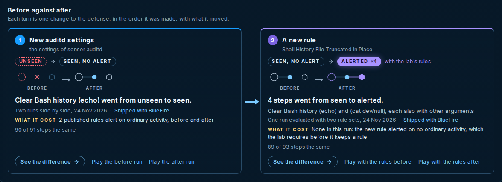

  

<h1 align="center">BlueFire Nexus</h1>

<strong>Watch an attack move through a real network, step by step, next to what its defenses saw.</strong> 
Each step is drawn on a map and marked alerted, seen (recorded, no alert) or unseen (not recorded).

Wazuh, an open-source security monitor, alerted on the password guessing on the web server a minute in. About eleven minutes later the build server's signing secret was copied to inet, the stand-in internet, with no alert.

## Open the recording

Download [`docs/live-view/attack-path.html`](docs/live-view/attack-path.html) and open it in a browser; it holds this recording and works offline.

Or run `docker compose up app`, open the address it prints, and choose **Runs** in the menu, then the attack path: the app replays the recorded runs and attacks nothing on your machine. With Docker Desktop, switch on "Enable host networking" in its settings first.

The network is seven containers built from one spec file, on networks with no route out, and it was recorded on a GitHub-hosted runner. Each step runs a test from Atomic Red Team, a public library of attack tests. [How the network is built and run](lab/README.md#range-one-its-hosts) names each host and gives the command that runs the path in Docker.

## What you can do with it

### Read what no rule alerted on

Every step after the password guessing was recorded, and no rule alerted on any of them. In the recording, drag the timeline to step 9, pictured: every stock rule that matched it was below alert level, and the screen names the one to start from.

### Change a defense, see before and after

On the Runs screen, **Before against after** holds two changes to a Linux machine's defense: new auditd settings took "Clear Bash history (echo)" from unseen to seen, then a rule written by hand from its event alerted on 4 steps that were seen. The score counts published rules only, so it still marks those 4 steps seen.

### Find what nobody saw

On the Runs screen, open the run on one Linux machine and press **Analyse**: the table lists first the one unseen test, "Clear Bash history (echo)". Click it: the panel beside the table says what happened and where to start.

### See what hardening stopped

Some of those tests ran a second time on a hardened machine. In **Analyse**, the **Hardened** tab lists these reruns, each marked stopped or not; **Watch from here** on one shows it with the hardening change named, next to what the same test did without it.

---

<a href="docs/README.md">Documentation</a> · <a href="docs/WORKSPACE.md">The full tour</a> · <a href="docs/INSTALLATION.md">Install</a> · <a href="lab/README.md">How the runs are made</a> · <a href="docs/SCOPE.md">Scope</a> · <a href="LICENSE">License</a>

