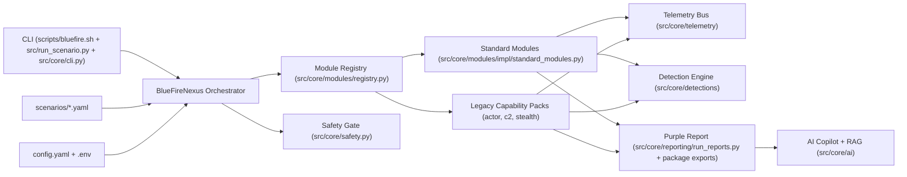

# BlueFire-Nexus Architecture

This document describes the secure, modular architecture used by BlueFire-Nexus.

## High-Level Design

## Execution Flow

1. CLI resolves a scenario profile or scenario file.
2. `BlueFireNexus` loads config via `ConfigManager`.
3. `SafetyGate` enforces:
   - `general.dry_run` behavior
   - `general.safeties.allowed_subnets`
   - `general.safeties.max_runtime`
   - destructive-operation acknowledgment
4. Legacy capability controls resolve global and granular activation:
   - one master lab toggle for all legacy packs
   - per-pack toggles
   - per-capability toggles
   - `simulate` vs `emulate` mode
5. Module registry builds standard modules, legacy capability packs, and
   optional plugins. `BUILTIN_MODULE_CLASSES` in
   `src/core/modules/registry.py` is the single source of truth for
   first-party modules and registration order.
6. Each step returns a normalized `ModuleResult` (see
   "ModuleResult contract" below).
7. Telemetry events are emitted to the local JSONL sink only. Outbound
   SIEM exporters were removed during baseline stabilization; legacy
   `telemetry.sinks` config entries naming `splunk`/`opensearch`/
   `elasticsearch`/`ngsiem` are warned-and-ignored at load time.
8. Detection artifacts (Sigma, YARA-L, SPL) are generated per module
   result. SPL is a local detection-rule output format, not a Splunk
   exporter or SIEM connector. See "Detection-output story" below.
9. A purple-team report is written and optionally augmented by AI copilot
   output.

## Mode model

Every run is shaped by three orthogonal mode controls. The defaults are
safe; advanced behaviour requires explicit opt-in.

- **`general.dry_run`** (default `true`). When true, no module is permitted
  to invoke real subprocess/socket/HTTP primitives; modules synthesise
  telemetry and artifacts locally. The contract is enforced by
  `tests/test_module_safety.py`.
- **Legacy capability `mode`**: `simulate` (default for any enabled
  capability) or `emulate`. `simulate` produces local telemetry/artifacts
  describing the technique without invoking the real research code path.
  `emulate` requires explicit lab confirmation at the global, pack, or
  capability level.
- **`ExecutionModule.allow_real_execution`** (default `false`). Real
  `subprocess.run` invocations require BOTH `dry_run=False` AND
  `allow_real_execution=True`. Either default leaves execution simulated.

The intersection of these gates is enforced by code AND by the
registry-wide tests in `tests/test_module_contract.py`,
`tests/test_module_safety.py`, and `tests/test_module_artifact_paths.py`.

## ModuleResult contract

Every module's `execute()` must return a `ModuleResult`
(`src/core/models.py`) with:

| Field             | Type                       | Notes                                            |
| ----------------- | -------------------------- | ------------------------------------------------ |
| `status`          | `ModuleStatus` literal     | `success` / `failure` / `blocked` / `skipped` / `partial_success` |
| `module`          | `str`                      | Must equal the registry key for the module       |
| `message`         | `str`                      | Human-readable summary                           |
| `techniques`      | `list[str]`                | ATT&CK technique IDs                             |
| `artifacts`       | `dict[str, Any]`           | Path values must resolve under `output_dir`      |
| `telemetry`       | `list[TelemetryEvent]`     | Each event's `module` matches the result module  |
| `detection_hints` | `dict[str, Any]`           | Optional keys: `title`, `logsource`, `detection`, `condition`, `mitre_technique` |
| `error`           | `str \| None`              | Short error summary when `status` indicates failure |
| `timestamp`       | `str` (ISO-8601 UTC)       | Auto-populated                                   |

`ModuleResult.__post_init__` emits a logger warning when a module returns
an unknown `status` value. The warning is non-fatal so plugins and
unaudited modules cannot break callers; the contract test surfaces the
same condition as a test failure.

## Detection-output story

Each module attaches `detection_hints` to its `ModuleResult`. The detection
engine (`src/core/detections/engine.py`) consumes those hints to emit
local artifact files per run:

- **Sigma** rules — `output/<run_id>/detections/sigma/*.yml`
  (`src/core/detections/sigma.py`)
- **YARA-L** rules — `output/<run_id>/detections/yara_l/*.yaral`
  (`src/core/detections/yara_l.py`)
- **Splunk SPL** detections — `output/<run_id>/detections/spl/*.spl`
  (`src/core/detections/spl.py`). This is a local detection-rule output
  format that an analyst can paste into a Splunk search; BlueFire-Nexus
  does **not** ship a Splunk exporter or SIEM connector in the baseline.

The hint keys used by the generators are `title`, `logsource`,
`detection`, `condition`, `mitre_technique`, and topic-specific extras
such as `network_protocol`, `network_url`, `process_command_line`.

## Local-first artifact flow

Every run produces the following local artifacts under `output/<run_id>/`:

- `telemetry.jsonl` — append-only event log via the JSONL sink
- `report.md` and `report.json` — purple-team run report
- `risk_summary.json` — per-run risk posture
- `detections/{sigma,yara_l,spl}/*` — detection drafts
- `copilot/*` — optional AI copilot artifacts (template fallback when no
  provider is configured)

Nothing in the baseline pushes these artifacts out of the run directory.

## Roadmap (out of current baseline)

The following are intentionally **not** present in the current baseline.
They are listed so contributors don't add them by accident:

- Outbound SIEM exporters (Splunk HEC, OpenSearch, Elasticsearch, NGSIEM,
  generic HTTP bulk). Removed during stabilization; not slated for
  reintroduction.
- A standalone observed-telemetry collector / correlator that ingests
  telemetry from external endpoints. Future work; no scaffolding ships
  today.
- Remote AI copilot integrations beyond the user-configured providers
  list.

## Key Components

- `src/core/bluefire_nexus.py`: orchestrator and scenario runner
- `src/core/config.py`: safe-by-default config loader
- `src/core/models.py`: `ModuleResult`, `TelemetryEvent`, `RunContext`,
  `ModuleStatus` literal, `ALLOWED_STATUSES`
- `src/core/modules/base.py`: module contract
- `src/core/modules/registry.py`: module assembly + plugin merge,
  exposes `BUILTIN_MODULE_CLASSES` as the source of truth
- `src/core/modules/impl/legacy_base.py`: shared adapter utilities for legacy packs
- `src/core/modules/impl/legacy_packs.py`: actor, protocol, and stealth capability-pack adapters
- `src/core/modules/impl/legacy_runtime.py`: safe execution wrappers for legacy internals in emulate mode
- `src/core/legacy_controls.py`: master-toggle plus granular-toggle resolution and activation summaries
- `src/core/telemetry/sinks.py`: local JSONL sink (baseline is local-first; outbound SIEM exporters were removed during stabilization)
- `src/core/telemetry/bus.py`: fan-out bus
- `src/core/detections/engine.py`: detection artifact generation
- `src/core/ai/copilot.py`: plan/narrate/suggest workflows
- `src/core/ai/rag.py`: lightweight local retrieval index
- `src/core/reporting/__init__.py`: public imports for APT reporting classes and JSON/Markdown run outputs
- `src/core/reporting/run_reports.py`: `write_markdown_report`, `write_json_report`, `write_risk_summary`, `build_risk_summary`

## Security Model

- No secret values are committed; environment values are loaded from `.env` templates.
- Remote telemetry and AI calls are disabled by default unless explicitly configured.
- Runtime safety checks prevent out-of-scope targeting and unsafe operations.
- Legacy research packs are disabled by default and can be enabled either:
  - globally through one lab toggle, or
  - one-by-one for granular control.
- `simulate` mode is the default for legacy packs; `emulate` requires explicit lab confirmation.
- Backward-compatible aliases are supported for legacy configuration keys (e.g.,
  `lab_mode`/`lab_acknowledged`, `network_obfuscator`, `anti_detection`) so
  older configs continue to resolve into canonical capability controls.
- Emulate-mode runtime failures are surfaced as telemetry + report metadata by default, while keeping
  the scenario progressing unless safety gates explicitly block execution.
- Security scanning and dependency auditing are enforced in CI.
