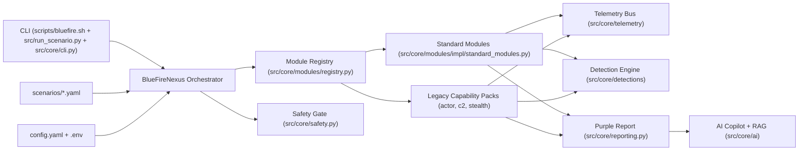

# BlueFire-Nexus Architecture

This document describes the secure, modular architecture used by BlueFire-Nexus.

## High-Level Design

## Execution Flow

1. CLI resolves a scenario profile or scenario file.
2. `BlueFireNexus` loads config via `ConfigManager`.
3. `SafetyGate` enforces:
   - `general.dry_run` behavior
   - `general.safeties.allowed_subnets`
   - `general.safeties.max_runtime`
   - destructive-operation acknowledgment
4. Legacy capability controls resolve global and granular activation:
   - one master lab toggle for all legacy packs
   - per-pack toggles
   - per-capability toggles
   - `simulate` vs `emulate` mode
5. Module registry builds standard modules, legacy capability packs, and optional plugins.
6. Each step returns a normalized `ModuleResult`.
7. Telemetry events are emitted via sink adapters (JSONL default, remote sinks opt-in).
8. Detection artifacts (Sigma, YARA-L, SPL) are generated per module result.
9. A purple-team report is written and optionally augmented by AI copilot output.

## Key Components

- `src/core/bluefire_nexus.py`: orchestrator and scenario runner
- `src/core/config.py`: safe-by-default config loader
- `src/core/models.py`: `ModuleResult`, `TelemetryEvent`, `RunContext`
- `src/core/modules/base.py`: module contract
- `src/core/modules/registry.py`: module assembly + plugin merge
- `src/core/modules/impl/legacy_base.py`: shared adapter utilities for legacy packs
- `src/core/modules/impl/legacy_packs.py`: actor, protocol, and stealth capability-pack adapters
- `src/core/modules/impl/legacy_runtime.py`: safe execution wrappers for legacy internals in emulate mode
- `src/core/legacy_controls.py`: master-toggle plus granular-toggle resolution and activation summaries
- `src/core/telemetry/sinks.py`: JSONL, OpenSearch, Elasticsearch, NGSIEM, Splunk HEC sinks
- `src/core/telemetry/bus.py`: fan-out bus
- `src/core/detections/engine.py`: detection artifact generation
- `src/core/ai/copilot.py`: plan/narrate/suggest workflows
- `src/core/ai/rag.py`: lightweight local retrieval index

## Security Model

- No secret values are committed; environment values are loaded from `.env` templates.
- Remote telemetry and AI calls are disabled by default unless explicitly configured.
- Runtime safety checks prevent out-of-scope targeting and unsafe operations.
- Legacy research packs are disabled by default and can be enabled either:
  - globally through one lab toggle, or
  - one-by-one for granular control.
- `simulate` mode is the default for legacy packs; `emulate` requires explicit lab confirmation.
- Emulate-mode runtime failures are surfaced as telemetry + report metadata by default, while keeping
  the scenario progressing unless safety gates explicitly block execution.
- Security scanning and dependency auditing are enforced in CI.
