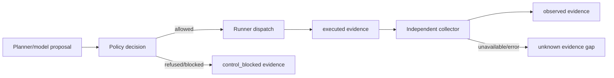

# Evidence model

BlueFire preserves a graph of attributable claims. Provenance answers **how this record was produced**, not whether the content is universally true.

## Provenance classes

| Provenance | Producer and meaning | It does not prove |
|---|---|---|
| `synthetic` | Deterministic simulation or declared fixture model | That an action ran or a defense observed it |
| `executed` | Rust runner reports an action started/resulted | Independent observation or defensive detection |
| `observed` | A separate declared collector read an observable | Causality without parent/context analysis |
| `control_blocked` | Policy or a declared control prevented dispatch/effect | That the requested action succeeded |
| `counterfactual` | Planner modeled continuation after a real path stopped | That the continuation occurred |
| `unknown` | Observation was unavailable, invalid, timed out, or otherwise unestablished | Absence of the underlying activity |

Never relabel between these classes to make a run appear complete.

## Record contract

A `bluefire.evidence.v1` record contains:

- generated evidence ID;
- run, step, behavior, optional action, and optional runner-profile identity;
- producer and timestamp;
- environment description and target-scope reference;
- same-run parent evidence IDs;
- structured content and content hash;
- whole-record hash;
- confidence from 0 to 1;
- explicit limitations.

The evidence graph requires parents to exist before a child is added and refuses cross-run parent edges. Replay creates new evidence; it does not graft source-run records into the new run's evidence graph.

Content and record hashes are deterministic integrity identifiers. They are not signatures or proof of producer identity.

## Proposal, execution, and observation



A policy allow is not execution. An execution receipt is not observation. Observation is not automatically a detection match.

## Built-in observation

### Sandbox filesystem observer

`SandboxObserver` reads one declared normalized relative file under an existing sandbox root. It:

- refuses absolute/traversal/link paths and files outside the root;
- enforces configured byte and read-time limits;
- records size, SHA-256, modification time, and relative path;
- detects a size/mtime change during collection;
- describes itself as filesystem-only.

### Collector registry

| Collector | Readiness | Evidence |
|---|---|---|
| `collector.filesystem.sandbox.v1` | Ready when its root is readable | Observed file metadata/hash or explicit unknown gap |
| `collector.fixture-jsonl.v1` | Ready for configured disposable JSONL fixtures | One observed record per bounded JSON object or unknown gap |
| `collector.sysmon-eventlog.v1` | Descriptor only | Unavailable until a real adapter/channels/access are configured |
| `collector.auditd.v1` | Descriptor only | Unavailable until a real adapter/audit access are configured |
| `collector.pcap-disposable.v1` | Descriptor only | Unavailable until a disposable CIDR/capture adapter is configured |
| `collector.siem-query.v1` | Descriptor only | Unavailable until a read-only provider adapter is configured |

Collector readiness is `ready`, `degraded`, or `unavailable`. A failed requested collection emits an `unknown` evidence-gap record with zero confidence rather than disappearing.

The built-in orchestrator observes eligible runner-created files through the sandbox observer. General collector configuration is a library boundary in 0.1.x; optional host/SIEM adapters are not integrated production collectors.

## Run bundle

Each run directory contains fixed-name records:

- `scenario.json`
- `plan.json`
- `policy.json`
- `profile.json`
- `result.json`
- `evidence.json`
- `detections.json`
- `events.jsonl`
- `manifest.json` after finalization

JSON snapshots are written by same-directory atomic replacement. Events have contiguous sequence numbers, previous-event hashes, and per-row hashes. Finalization records file SHA-256 values and sizes, then hashes that file table.

Validate a bundle:

```bash
bluefire --runs-dir .bluefire-runs bundle validate RUN_ID
```

Validation detects missing or modified covered files. A user able to rewrite the entire bundle can recompute hashes; use OS access control or external signing for stronger assurance.

## Retention and sharing

Run bundles may include scenario parameters, environment descriptors, relative filenames, telemetry summaries, model metadata, and defensive observations. Before sharing:

1. validate the original bundle;
2. make a separate sanitized export rather than editing the original;
3. remove secrets, personal identifiers, real internal targets, and private telemetry;
4. preserve provenance/limitations and state that the export is sanitized;
5. apply the appropriate license/authorization policy.

Browser-side retention settings are not a server-side deletion policy in 0.1.x. Apply retention and disk quotas through protected local storage controls.
