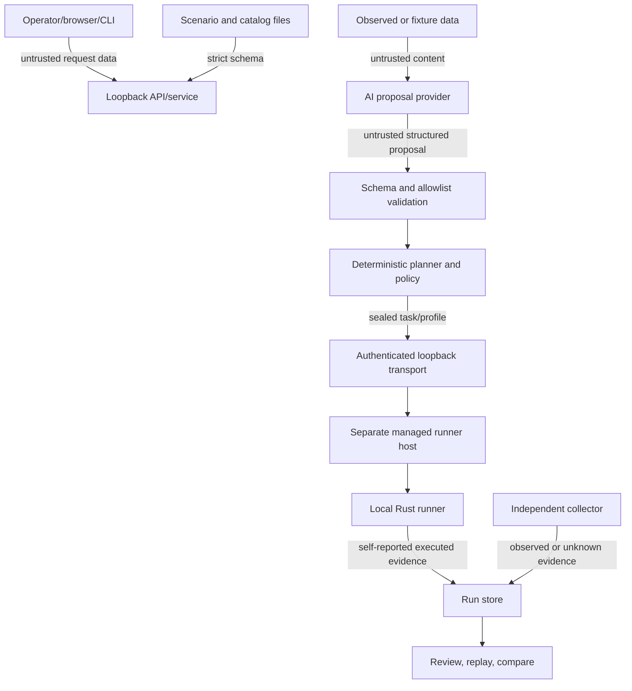

# Threat model

This document describes the current BlueFire Nexus 0.1.x local-first architecture. It is a design and review aid, not a formal security proof.

## Security objectives

BlueFire aims to:

1. keep scenario, UI, plugin, and model data from becoming arbitrary executable input;
2. require an explicit runner profile and target scope for every real effect;
3. preserve the distinction between proposal, policy authorization, runner report, independent observation, and detection conclusion;
4. bound time, output, file count, artifact size, filesystem paths, and network destinations;
5. make effects and cleanup attributable through structured receipts and evidence links;
6. keep secrets out of declarative configuration and public artifacts.

It cannot make a compromised operating system, Python process, runner binary, operator account, or filesystem trustworthy.

## Assets

- operator authorization and approval intent;
- runner profiles and their scope/capability limits;
- the runner binary and static action inventory;
- scenario, behavior, action, plugin, and research-source contracts;
- provider credentials referenced through environment variables;
- run bundles, evidence, detections, receipts, and comparison results;
- runner-owned sandbox contents and any configured local export;
- defensive telemetry reachable through optional collectors.

## Trust boundaries

The current runner transport is a separately hosted same-user loopback service. Local enrollment issues exact client/runner identities, TLS 1.3 provides mutual authentication and encryption, enrollment-derived authenticators bind tasks, and a durable ledger provides duplicate recovery and cancellation state. Cross-host transport or enrollment is not shipped.

## Assumptions

- The operator controls the local account and has explicit authorization for the selected lab.
- The configured runner binary and sandbox root are protected by operating-system permissions.
- Execute targets are disposable or otherwise intentionally prepared; the default profile authorizes only a runner-owned workspace, local export, and loopback.
- Environment-variable values are supplied through a protected local mechanism.
- External research and optional packages are reviewed and pinned before release use.

## Threats, mitigations, and residual risk

| Threat | Current mitigations | Residual risk / operator action |
|---|---|---|
| Malicious scenario file | Versioned strict schemas, unknown-field rejection, registered IDs, typed parameters/artifacts, DAG and dominance validation, explicit outcomes | A valid graph can still consume its allowed budgets. Review provenance, objective, actions, and preflight. |
| Arbitrary model-authored execution | Strict proposal schema; registered step/behavior/action allowlists; forbidden executable-field rejection; deterministic planning and policy remain authoritative | A model may make a poor but in-envelope selection. Use Assist for review and keep profiles least-privilege. |
| Prompt injection from evidence | Redaction by key, string limits, observed-content exclusion by default, bounded request, structured output, no tools, deterministic fallback | Any data sent to a provider crosses that provider's privacy boundary. Keep `include_evidence_content: false` unless reviewed. |
| Invalid or oversized model output | Timeouts, retries, 1 MiB response limit, output-token budget, exact JSON schema, deterministic fallback | Provider availability and billing remain external concerns. Set conservative limits and monitor metadata. |
| Malicious plugin/action package | Plugin loader is manifest-only; signed action packages are canonical, bounded, content-addressed, locally trusted, signature-verified, and restricted to reviewed compiled runner operations | Publisher trust is local policy, not a public PKI. Review source, license, digest, build chain, and publisher-key enrollment before activation. |
| Action-package database rollback | Immutable version rows and trust/lifecycle events use transactions, constraints, append-only triggers, and read-time structural/signature audits | SQLite is not an external transparency log. An actor who can replace the database or drop triggers and truncate rows can restore an older valid prefix, including pre-revocation trust or package versions. Protect the database with OS permissions and use externally anchored backups/audit logs where rollback resistance is required. |
| Target-scope confusion | Execute requires explicit scope refs; service checks profile containment; adapter derives action scope; Python policy and runner enforce again | Scope names are local policy identifiers, not organizational authorization. Use distinct profiles per lab. |
| Approval bypass | Shipped Execute profiles require approval; approval is short-lived and bound to request hash, action, profile, and scope digest | The local CLI confirmation trusts the caller's OS account and is not multi-user authentication. Do not expose the service. |
| Runner impersonation | Native package digest/platform/architecture/inventory verification; owner-private managed roots; exact local enrollment identities; TLS 1.3 mutual authentication; enrollment-bound process records and task authenticators; exact result correlation | BlueFire does not provide cross-host enrollment or an external code-signing trust chain. A compromised same-user control plane, runner binary, or OS remains authoritative inside that account. |
| Task replay | Task/profile/request/policy identity binding; expiry; authenticated durable singleton ledger; exact duplicate-result recovery; task-ID collision refusal | A compromised enrolled control plane can authorize a new in-policy task. Preserve the managed ledger until every task and receipt is reconciled. |
| Capability/tier expansion | Registry/profile intersection, allowlist, blocklist, exact capabilities, safety-tier checks, runner-side revalidation | A misconfigured broad profile is broad authority. Treat profile review as a security change. |
| Path traversal or link escape | Relative normalized paths; drive/UNC/device/traversal rejection; canonical sandbox root; symlink/reparse refusal; create-new semantics | Filesystem race resistance depends on platform APIs and local account isolation. Keep the sandbox private and disposable. |
| Unintended network access | Current action accepts literal loopback IP only; CIDR allowlist; no DNS, URL, redirect, or proxy | No general network testing ships. Do not modify the action/profile merely to bypass this boundary. |
| Secret leakage | Config stores environment-variable names; browser has no plaintext-secret field; model redaction; safe API errors | Run artifacts can contain filenames, telemetry, or operator-entered text. Review before sharing and set retention controls externally. |
| CSRF/host-header abuse | Loopback bind enforcement, exact Host validation, same-origin mutation requirement, no permissive CORS, bounded bodies, restrictive browser headers, a one-use URL-fragment bootstrap capability, and a bounded strict HttpOnly API session cookie | The browser session is same-user local protection, not remote or multi-user identity. Malicious software controlling the same account or browser remains in the threat model. |
| Log/UI injection | Structured JSON, bounded strings/output, React escaping, no request-path logging by default | Exported data may be opened in other tools. Treat evidence fields as untrusted and avoid unsafe rendering. |
| Compromised runner | Runner cannot label evidence `observed`; results are identity-correlated; separate collectors; immutable bundle snapshots | A compromised runner can lie about its own execution and manipulate its sandbox. Independent telemetry is essential for high-confidence conclusions. |
| Evidence tampering | Content-derived evidence IDs, same-run parent validation, hash-chained events, finalized file table and bundle hash | Hashes are not signatures. Anyone who can rewrite the whole store can recompute them. Protect or externally sign important bundles. |
| Collector failure | Readiness states, time/size/record bounds, explicit `unknown` evidence-gap records | Optional audit/SIEM adapters are descriptors only. Missing telemetry must remain visible, not inferred. |
| Cleanup receipt loss or tampering | Durable intent/effect/commit journal; no-overwrite publication; pending-intent discovery; path/type/size/digest revalidation; reverse-order cleanup; tamper-safe retention | Process interruption can leave a pending intent, but it remains attributable while the runner-owned workspace survives. Host/workspace loss can destroy recovery state or leave external effects; preserve the complete sandbox until reconciliation. |
| Research supply-chain compromise | Pinned versions/URLs, retrieval dates, license review, external-only caches, no wholesale vendoring or automatic external script execution | Package repositories and source accounts can be compromised. Verify release hashes/signatures where available. |
| Resource exhaustion | API body limit, graph budgets, runner limits, collector limits, bounded captured output, event pagination | The local run directory has no built-in disk quota. Monitor storage and apply OS-level quotas/retention. |

## Deployment guidance

- Keep the API on `127.0.0.1` or `::1`; do not publish it without a separately reviewed authentication layer.
- Run the control plane and runner as an unprivileged account.
- Use a dedicated disposable sandbox that contains no personal or production data.
- Keep Execute profiles narrow: exact actions, platforms, capabilities, tiers, scopes, CIDRs, and budgets.
- Start with AI Off; use Assist when introducing a model or new scenario.
- Keep model evidence-content forwarding disabled unless data classification permits it.
- Use independent observation before treating runner claims as validation.
- Validate the finalized bundle and review outstanding cleanup receipts before destroying a disposable environment.

## Out of scope for current guarantees

- hostile multi-user or remote service exposure;
- a compromised kernel, administrator/root account, Python process, or runner binary;
- cross-host runner identity, transport, enrollment, or revocation;
- digital signatures or non-repudiation for profiles, approvals, tasks, evidence, or bundles;
- complete prevention of all filesystem time-of-check/time-of-use races;
- production-grade SIEM, EDR, cloud, or identity collector correctness;
- safety of historical Git code or locally modified actions.

Report vulnerabilities privately using [the security policy](../SECURITY.md).
